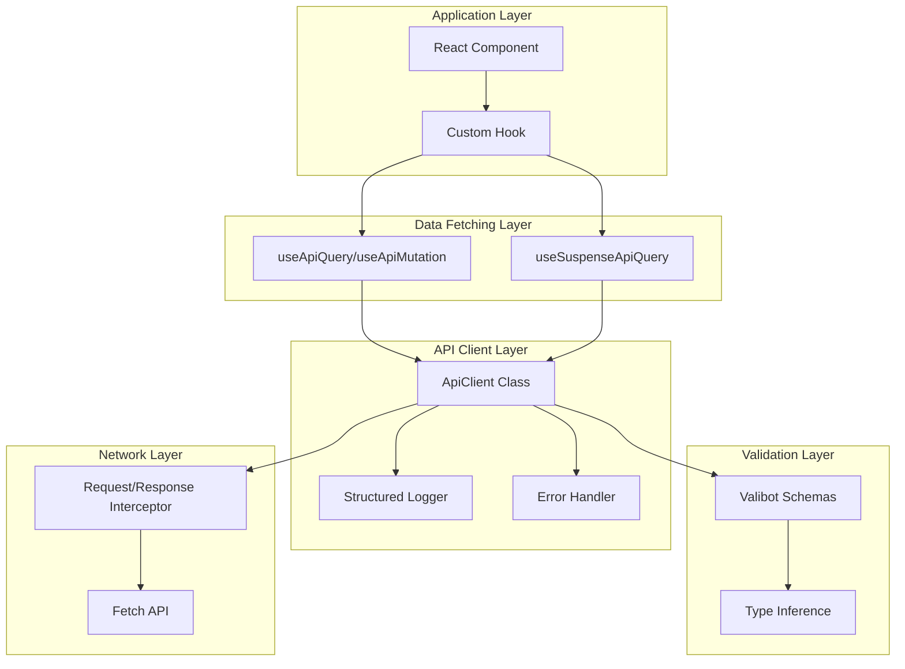
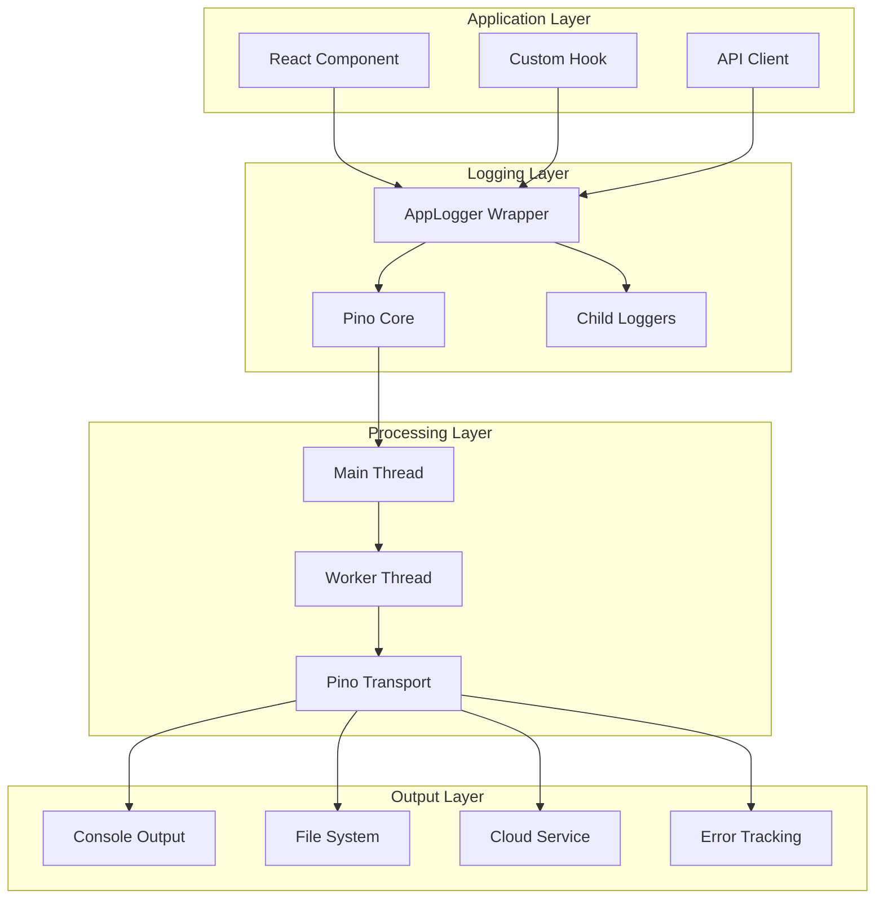

# データフェッチング層リファクタリング設計書

> 作成日: 2025年1月16日  
> ブランチ: `feature/data-fetching-layer-refactor`  
> 関連ドキュメント: [refactoring-analysis-2025.md](./refactoring-analysis-2025.md)

## 📋 エグゼクティブサマリー

本設計書は、PS-PSプロジェクトのデータフェッチング層を根本的に改善するための詳細設計です。Valibot v1.1.0を活用した型安全なランタイム検証、TypeScript 5.9.2の最新機能、React 19.1.1のSuspense機能を最大限に活用し、重複コードを90%削減しつつ、開発者体験とユーザー体験を劇的に向上させます。

### 主要な改善ポイント
- **Valibotによる完全な型安全性**: コンパイル時とランタイムの両方で型保証
- **共通APIクライアント**: 重複コードを完全排除
- **自動エラーハンドリング**: 一貫性のあるエラー処理
- **React Suspenseの活用**: 宣言的なローディング状態管理
- **console.logの完全削除**: 構造化ログによる本番環境対応

---

## 🏗️ アーキテクチャ概要



---

## 🔧 コア実装

### 1. Valibot スキーマ定義 (最新v1.1.0機能活用)

#### `src/schemas/api/common.schema.ts`
```typescript
import * as v from 'valibot';

// ブランド型の定義
export const JobNoSchema = v.pipe(
  v.string(),
  v.regex(/^[A-Z0-9]{8}$/),
  v.brand('JobNo')
);
export type JobNo = v.InferOutput<typeof JobNoSchema>;

export const FgCodeSchema = v.pipe(
  v.string(),
  v.minLength(1),
  v.brand('FgCode')
);
export type FgCode = v.InferOutput<typeof FgCodeSchema>;

export const PipCodeSchema = v.pipe(
  v.string(),
  v.minLength(1),
  v.brand('PipCode')
);
export type PipCode = v.InferOutput<typeof PipCodeSchema>;

// APIレスポンスのエンベロープ
export const ApiEnvelopeSchema = <T extends v.BaseSchema<unknown, unknown, v.BaseIssue<unknown>>>(
  dataSchema: T
) => v.object({
  success: v.boolean(),
  data: dataSchema,
  messages: v.optional(v.array(
    v.object({
      code: v.string(),
      message: v.string(),
      severity: v.picklist(['info', 'warning', 'error'])
    })
  )),
  metadata: v.optional(v.object({
    timestamp: v.pipe(v.string(), v.isoTimestamp()),
    version: v.string(),
    pagination: v.optional(v.object({
      page: v.number(),
      limit: v.number(),
      total: v.number(),
      hasMore: v.boolean()
    }))
  }))
});

// エラーレスポンス
export const ApiErrorSchema = v.object({
  error: v.object({
    code: v.string(),
    message: v.string(),
    details: v.optional(v.unknown()),
    timestamp: v.pipe(v.string(), v.isoTimestamp()),
    traceId: v.optional(v.string())
  })
});
```

#### `src/schemas/api/item.schema.ts`
```typescript
import * as v from 'valibot';
import { JobNoSchema, FgCodeSchema, ApiEnvelopeSchema } from './common.schema';

// アイテムスキーマ（完全な型定義）
export const ItemSchema = v.object({
  // 必須フィールド
  itemSurKey: v.string(),
  jobNo: JobNoSchema,
  fgCode: FgCodeSchema,
  itemNo: v.string(),
  itemCoreNo: v.string(),
  itemName: v.pipe(v.string(), v.minLength(1)),
  itemCostElement: v.string(),
  
  // オプショナルフィールド（nullableとoptionalを適切に使い分け）
  itemQty: v.optional(v.pipe(
    v.string(),
    v.transform((val) => parseInt(val, 10)),
    v.number(),
    v.minValue(0)
  )),
  itemAssignedQty: v.optional(v.pipe(
    v.string(),
    v.transform((val) => parseInt(val, 10)),
    v.number(),
    v.minValue(0)
  )),
  itemAssignQty: v.optional(v.pipe(
    v.string(),
    v.transform((val) => parseInt(val, 10)),
    v.number(),
    v.minValue(0)
  )),
  itemUnassignedQty: v.optional(v.pipe(
    v.string(),
    v.transform((val) => parseInt(val, 10)),
    v.number(),
    v.minValue(0)
  )),
  itemSortKey: v.optional(v.string()),
  itemIBSCode: v.optional(v.string()),
  itemIbsCode: v.optional(v.string()), // 統一すべきだが現状維持
  itemIsAssign: v.optional(v.picklist(['0', '1']))
});

export type Item = v.InferOutput<typeof ItemSchema>;

// APIレスポンススキーマ
export const GetItemsResponseSchema = ApiEnvelopeSchema(
  v.object({
    items: v.array(ItemSchema)
  })
);

export type GetItemsResponse = v.InferOutput<typeof GetItemsResponseSchema>;
```

#### `src/schemas/api/pip.schema.ts`
```typescript
import * as v from 'valibot';
import { JobNoSchema, FgCodeSchema, PipCodeSchema, ApiEnvelopeSchema } from './common.schema';

// PIPスキーマ
export const PipSchema = v.object({
  jobNo: JobNoSchema,
  fgCode: FgCodeSchema,
  pipCode: PipCodeSchema,
  pipNickName: v.string(),
  pipSortKey: v.string(),
  itemCount: v.optional(v.pipe(
    v.string(),
    v.transform((val) => parseInt(val, 10)),
    v.number(),
    v.minValue(0)
  )),
  vendorCount: v.optional(v.pipe(
    v.string(),
    v.transform((val) => parseInt(val, 10)),
    v.number(),
    v.minValue(0)
  ))
});

export type Pip = v.InferOutput<typeof PipSchema>;

// PIP詳細スキーマ
export const PipDetailSchema = v.object({
  ...PipSchema.entries,
  items: v.array(v.object({
    itemSurKey: v.string(),
    itemNo: v.string(),
    itemName: v.string(),
    quantity: v.number(),
    assignedQuantity: v.number()
  })),
  vendors: v.array(v.object({
    vendorCode: v.string(),
    vendorName: v.string(),
    status: v.picklist(['active', 'inactive'])
  }))
});

export type PipDetail = v.InferOutput<typeof PipDetailSchema>;

// APIレスポンススキーマ
export const GetPipsResponseSchema = ApiEnvelopeSchema(
  v.object({
    pipsList: v.array(PipSchema)
  })
);

export const GetPipDetailResponseSchema = ApiEnvelopeSchema(
  v.object({
    pipDetail: PipDetailSchema
  })
);

// ペイロードスキーマ（作成・更新用）
export const PipPayloadSchema = v.object({
  jobNo: JobNoSchema,
  fgCode: FgCodeSchema,
  pipNickName: v.pipe(v.string(), v.minLength(1), v.maxLength(100)),
  itemList: v.array(v.object({
    itemSurKey: v.string(),
    quantity: v.pipe(v.number(), v.minValue(1))
  }))
});

export type PipPayload = v.InferOutput<typeof PipPayloadSchema>;
```

### 2. 共通APIクライアント実装

#### `src/lib/api/client.ts`
```typescript
import * as v from 'valibot';
import { logger } from '../logger';
import type { PinoLogger } from '../logger';
import { ApiError, NetworkError, ValidationError } from './errors';
import type { RequestConfig, ApiResponse } from './types';
import { v4 as uuidv4 } from 'uuid';

/**
 * 型安全なAPIクライアントクラス
 * - Valibotによるランタイム検証
 * - 自動リトライ機能
 * - 構造化ログ
 * - エラーハンドリング
 */
export class ApiClient {
  private baseURL: string;
  private defaultHeaders: HeadersInit;
  private requestInterceptors: Array<(config: RequestConfig) => RequestConfig | Promise<RequestConfig>> = [];
  private responseInterceptors: Array<(response: Response) => Response | Promise<Response>> = [];
  private logger: PinoLogger;
  
  constructor(baseURL: string, defaultHeaders: HeadersInit = {}) {
    this.baseURL = baseURL;
    this.defaultHeaders = {
      'Content-Type': 'application/json',
      ...defaultHeaders
    };
    // APIクライアント専用のChild logger生成
    this.logger = logger.forComponent('ApiClient');
  }
  
  /**
   * リクエストインターセプター追加
   */
  addRequestInterceptor(interceptor: (config: RequestConfig) => RequestConfig | Promise<RequestConfig>) {
    this.requestInterceptors.push(interceptor);
    return () => {
      const index = this.requestInterceptors.indexOf(interceptor);
      if (index !== -1) this.requestInterceptors.splice(index, 1);
    };
  }
  
  /**
   * レスポンスインターセプター追加
   */
  addResponseInterceptor(interceptor: (response: Response) => Response | Promise<Response>) {
    this.responseInterceptors.push(interceptor);
    return () => {
      const index = this.responseInterceptors.indexOf(interceptor);
      if (index !== -1) this.responseInterceptors.splice(index, 1);
    };
  }
  
  /**
   * 型安全なGETリクエスト
   */
  async get<T>(
    path: string,
    schema: v.BaseSchema<T, unknown, v.BaseIssue<unknown>>,
    config: RequestConfig = {}
  ): Promise<T> {
    return this.request('GET', path, schema, { ...config, body: undefined });
  }
  
  /**
   * 型安全なPOSTリクエスト
   */
  async post<T, B = unknown>(
    path: string,
    body: B,
    schema: v.BaseSchema<T, unknown, v.BaseIssue<unknown>>,
    config: RequestConfig = {}
  ): Promise<T> {
    return this.request('POST', path, schema, { ...config, body });
  }
  
  /**
   * 型安全なPUTリクエスト
   */
  async put<T, B = unknown>(
    path: string,
    body: B,
    schema: v.BaseSchema<T, unknown, v.BaseIssue<unknown>>,
    config: RequestConfig = {}
  ): Promise<T> {
    return this.request('PUT', path, schema, { ...config, body });
  }
  
  /**
   * 型安全なDELETEリクエスト
   */
  async delete<T>(
    path: string,
    schema: v.BaseSchema<T, unknown, v.BaseIssue<unknown>>,
    config: RequestConfig = {}
  ): Promise<T> {
    return this.request('DELETE', path, schema, { ...config, body: undefined });
  }
  
  /**
   * 共通リクエスト処理
   */
  private async request<T>(
    method: string,
    path: string,
    schema: v.BaseSchema<T, unknown, v.BaseIssue<unknown>>,
    config: RequestConfig = {}
  ): Promise<T> {
    const url = `${this.baseURL}${path}`;
    const startTime = performance.now();
    
    // リクエスト設定のマージ
    let requestConfig: RequestConfig = {
      method,
      headers: {
        ...this.defaultHeaders,
        ...config.headers
      },
      ...config
    };
    
    // リクエストインターセプター適用
    for (const interceptor of this.requestInterceptors) {
      requestConfig = await interceptor(requestConfig);
    }
    
    // ボディのJSON変換
    if (requestConfig.body && typeof requestConfig.body !== 'string') {
      requestConfig.body = JSON.stringify(requestConfig.body);
    }
    
    // リクエストIDの生成
    const requestId = uuidv4();
    const requestLogger = this.logger.child({ requestId });
    
    // ログ出力（Pino形式）
    requestLogger.debug({
      msg: 'API Request',
      api: {
        method,
        url,
        headers: import.meta.env.DEV ? requestConfig.headers : undefined,
        body: import.meta.env.DEV ? requestConfig.body : undefined
      }
    });
    
    try {
      // fetch実行（リトライロジック付き）
      const response = await this.fetchWithRetry(url, requestConfig);
      
      // レスポンスインターセプター適用
      let processedResponse = response;
      for (const interceptor of this.responseInterceptors) {
        processedResponse = await interceptor(processedResponse);
      }
      
      // ステータスチェック
      if (!processedResponse.ok) {
        throw new ApiError(
          processedResponse.status,
          processedResponse.statusText,
          await this.extractErrorDetails(processedResponse)
        );
      }
      
      // レスポンスボディのパース
      const responseData = await processedResponse.json();
      
      // Valibotによる検証
      const parseResult = v.safeParse(schema, responseData);
      
      if (!parseResult.success) {
        requestLogger.error({
          msg: 'Validation Error',
          api: { url },
          err: {
            type: 'ValidationError',
            message: 'Response validation failed',
            issues: parseResult.issues
          },
          data: import.meta.env.DEV ? responseData : undefined
        });
        throw new ValidationError('Response validation failed', parseResult.issues);
      }
      
      // 成功ログとメトリクス記録
      const duration = performance.now() - startTime;
      requestLogger.info({
        msg: 'API Success',
        api: {
          method,
          url,
          statusCode: processedResponse.status,
          duration
        }
      });
      
      // パフォーマンスメトリクス
      logger.metric('api.request.duration', duration, {
        method,
        path,
        status: processedResponse.status
      });
      
      return parseResult.output;
      
    } catch (error) {
      // エラーログ
      const duration = performance.now() - startTime;
      requestLogger.error({
        msg: 'API Error',
        api: {
          method,
          url,
          duration,
          error: error instanceof Error ? {
            type: error.constructor.name,
            message: error.message,
            stack: import.meta.env.DEV ? error.stack : undefined
          } : 'Unknown error'
        },
        err: error instanceof Error ? error : new Error('Unknown error')
      });
      
      // エラーの再スロー
      if (error instanceof ApiError || error instanceof ValidationError) {
        throw error;
      }
      
      // ネットワークエラー
      if (error instanceof TypeError && error.message.includes('fetch')) {
        throw new NetworkError('Network request failed', error);
      }
      
      throw error;
    }
  }
  
  /**
   * リトライ機能付きfetch
   */
  private async fetchWithRetry(
    url: string,
    config: RequestConfig,
    maxRetries = 3
  ): Promise<Response> {
    let lastError: Error | undefined;
    
    for (let attempt = 0; attempt <= maxRetries; attempt++) {
      try {
        // 指数バックオフ
        if (attempt > 0) {
          const delay = Math.min(1000 * Math.pow(2, attempt - 1), 10000);
          await new Promise(resolve => setTimeout(resolve, delay));
          this.logger.debug({
            msg: `Retry attempt ${attempt}/${maxRetries}`,
            api: { url },
            retry: { attempt, maxRetries, delay }
          });
        }
        
        // AbortController for timeout
        const controller = new AbortController();
        const timeout = config.timeout ?? 30000;
        const timeoutId = setTimeout(() => controller.abort(), timeout);
        
        try {
          const response = await fetch(url, {
            ...config,
            signal: controller.signal
          });
          clearTimeout(timeoutId);
          
          // 5xx エラーの場合はリトライ
          if (response.status >= 500 && attempt < maxRetries) {
            lastError = new Error(`Server error: ${response.status}`);
            continue;
          }
          
          return response;
        } finally {
          clearTimeout(timeoutId);
        }
        
      } catch (error) {
        lastError = error as Error;
        
        // ネットワークエラーまたはタイムアウトの場合はリトライ
        if (
          error instanceof TypeError ||
          (error instanceof Error && error.name === 'AbortError')
        ) {
          if (attempt === maxRetries) {
            throw new NetworkError(
              `Network request failed after ${maxRetries + 1} attempts`,
              error
            );
          }
          continue;
        }
        
        // その他のエラーは即座に投げる
        throw error;
      }
    }
    
    throw lastError || new Error('Unexpected error in fetchWithRetry');
  }
  
  /**
   * エラー詳細の抽出
   */
  private async extractErrorDetails(response: Response): Promise<unknown> {
    try {
      const contentType = response.headers.get('content-type');
      if (contentType?.includes('application/json')) {
        return await response.json();
      }
      return await response.text();
    } catch {
      return null;
    }
  }
}

// シングルトンインスタンスのエクスポート
export const apiClient = new ApiClient(
  import.meta.env.VITE_PSYS_API_URL || 'http://localhost:8080'
);

// インターセプター設定例
if (import.meta.env.DEV) {
  // 開発環境用のデバッグインターセプター（Pino使用）
  const interceptorLogger = logger.forComponent('ApiInterceptor');
  
  apiClient.addRequestInterceptor((config) => {
    interceptorLogger.trace({
      msg: 'Request Interceptor',
      config
    });
    return config;
  });
  
  apiClient.addResponseInterceptor(async (response) => {
    const clone = response.clone();
    try {
      const body = await clone.json();
      interceptorLogger.trace({
        msg: 'Response Interceptor',
        response: {
          url: response.url,
          status: response.status,
          headers: Object.fromEntries(response.headers.entries()),
          body
        }
      });
    } catch {
      interceptorLogger.trace({
        msg: 'Response Interceptor',
        response: {
          url: response.url,
          status: response.status,
          headers: Object.fromEntries(response.headers.entries()),
          body: '(not JSON)'
        }
      });
    }
    return response;
  });
}
```

### 3. カスタムエラークラス

#### `src/lib/api/errors.ts`
```typescript
import type { BaseIssue } from 'valibot';

/**
 * API エラー基底クラス
 */
export class ApiError extends Error {
  constructor(
    public status: number,
    public statusText: string,
    public details?: unknown
  ) {
    super(`API Error ${status}: ${statusText}`);
    this.name = 'ApiError';
  }
  
  /**
   * エラーがリトライ可能かどうか
   */
  isRetryable(): boolean {
    return this.status >= 500 || this.status === 429;
  }
  
  /**
   * クライアントエラーかどうか
   */
  isClientError(): boolean {
    return this.status >= 400 && this.status < 500;
  }
  
  /**
   * サーバーエラーかどうか
   */
  isServerError(): boolean {
    return this.status >= 500;
  }
}

/**
 * ネットワークエラー
 */
export class NetworkError extends Error {
  constructor(message: string, public cause?: Error) {
    super(message);
    this.name = 'NetworkError';
  }
}

/**
 * バリデーションエラー
 */
export class ValidationError extends Error {
  constructor(
    message: string,
    public issues: BaseIssue<unknown>[]
  ) {
    super(message);
    this.name = 'ValidationError';
  }
  
  /**
   * フィールドごとのエラーメッセージ取得
   */
  getFieldErrors(): Record<string, string[]> {
    const errors: Record<string, string[]> = {};
    
    for (const issue of this.issues) {
      const path = issue.path?.map(p => p.key).join('.') || 'root';
      if (!errors[path]) {
        errors[path] = [];
      }
      errors[path].push(issue.message);
    }
    
    return errors;
  }
}

/**
 * 認証エラー
 */
export class AuthenticationError extends ApiError {
  constructor(details?: unknown) {
    super(401, 'Unauthorized', details);
    this.name = 'AuthenticationError';
  }
}

/**
 * 認可エラー
 */
export class AuthorizationError extends ApiError {
  constructor(details?: unknown) {
    super(403, 'Forbidden', details);
    this.name = 'AuthorizationError';
  }
}

/**
 * Not Found エラー
 */
export class NotFoundError extends ApiError {
  constructor(resource: string, details?: unknown) {
    super(404, `${resource} not found`, details);
    this.name = 'NotFoundError';
  }
}

/**
 * Rate Limit エラー
 */
export class RateLimitError extends ApiError {
  constructor(
    public retryAfter?: number,
    details?: unknown
  ) {
    super(429, 'Too Many Requests', details);
    this.name = 'RateLimitError';
  }
}
```

### 4. React Query統合フック

#### `src/hooks/api/useApiQuery.ts`
```typescript
import { useQuery, useSuspenseQuery, type UseQueryOptions, type UseSuspenseQueryOptions } from '@tanstack/react-query';
import * as v from 'valibot';
import { apiClient } from '@/lib/api/client';
import type { ApiError } from '@/lib/api/errors';

/**
 * 型安全なAPIクエリフック
 */
export function useApiQuery<T>(
  queryKey: readonly unknown[],
  path: string,
  schema: v.BaseSchema<T, unknown, v.BaseIssue<unknown>>,
  options?: Omit<UseQueryOptions<T, ApiError>, 'queryKey' | 'queryFn'>
) {
  return useQuery<T, ApiError>({
    queryKey,
    queryFn: () => apiClient.get(path, schema),
    staleTime: 5 * 60 * 1000, // 5分
    gcTime: 10 * 60 * 1000,   // 10分
    retry: (failureCount, error) => {
      // 404エラーはリトライしない
      if (error.status === 404) return false;
      // サーバーエラーは3回までリトライ
      if (error.isServerError()) return failureCount < 3;
      // それ以外はリトライしない
      return false;
    },
    ...options
  });
}

/**
 * Suspense対応APIクエリフック
 */
export function useSuspenseApiQuery<T>(
  queryKey: readonly unknown[],
  path: string,
  schema: v.BaseSchema<T, unknown, v.BaseIssue<unknown>>,
  options?: Omit<UseSuspenseQueryOptions<T, ApiError>, 'queryKey' | 'queryFn'>
) {
  return useSuspenseQuery<T, ApiError>({
    queryKey,
    queryFn: () => apiClient.get(path, schema),
    staleTime: 5 * 60 * 1000,
    gcTime: 10 * 60 * 1000,
    retry: (failureCount, error) => {
      if (error.status === 404) return false;
      if (error.isServerError()) return failureCount < 3;
      return false;
    },
    ...options
  });
}
```

#### `src/hooks/api/useApiMutation.ts`
```typescript
import { useMutation, useQueryClient, type UseMutationOptions } from '@tanstack/react-query';
import * as v from 'valibot';
import { apiClient } from '@/lib/api/client';
import type { ApiError } from '@/lib/api/errors';
import { toast } from 'sonner';

interface ApiMutationOptions<TData, TVariables> {
  method: 'POST' | 'PUT' | 'DELETE';
  path: string | ((variables: TVariables) => string);
  schema: v.BaseSchema<TData, unknown, v.BaseIssue<unknown>>;
  invalidateQueries?: readonly unknown[][];
  optimisticUpdate?: (variables: TVariables) => void;
  successMessage?: string;
  errorMessage?: string;
}

/**
 * 型安全なAPIミューテーションフック
 */
export function useApiMutation<TData = unknown, TVariables = void>(
  options: ApiMutationOptions<TData, TVariables>,
  mutationOptions?: Omit<UseMutationOptions<TData, ApiError, TVariables>, 'mutationFn'>
) {
  const queryClient = useQueryClient();
  
  return useMutation<TData, ApiError, TVariables>({
    mutationFn: async (variables) => {
      const path = typeof options.path === 'function' 
        ? options.path(variables) 
        : options.path;
      
      switch (options.method) {
        case 'POST':
          return apiClient.post(path, variables, options.schema);
        case 'PUT':
          return apiClient.put(path, variables, options.schema);
        case 'DELETE':
          return apiClient.delete(path, options.schema);
        default:
          throw new Error(`Unsupported method: ${options.method}`);
      }
    },
    onMutate: async (variables) => {
      // 楽観的更新
      if (options.optimisticUpdate) {
        options.optimisticUpdate(variables);
      }
      
      // カスタムonMutate呼び出し
      if (mutationOptions?.onMutate) {
        return mutationOptions.onMutate(variables);
      }
    },
    onSuccess: (data, variables, context) => {
      // キャッシュ無効化
      if (options.invalidateQueries) {
        options.invalidateQueries.forEach(queryKey => {
          queryClient.invalidateQueries({ queryKey });
        });
      }
      
      // 成功メッセージ
      if (options.successMessage) {
        toast.success(options.successMessage);
      }
      
      // カスタムonSuccess呼び出し
      if (mutationOptions?.onSuccess) {
        mutationOptions.onSuccess(data, variables, context);
      }
    },
    onError: (error, variables, context) => {
      // エラーメッセージ
      const message = options.errorMessage || `操作に失敗しました: ${error.message}`;
      toast.error(message);
      
      // カスタムonError呼び出し
      if (mutationOptions?.onError) {
        mutationOptions.onError(error, variables, context);
      }
    },
    ...mutationOptions
  });
}
```

### 5. Pino ロガー実装

#### ロギング設計方針

##### 設計原則
1. **高性能**: Pinoの非同期ロギングによるオーバーヘッド最小化
2. **構造化ログ**: JSON形式による機械可読性の確保
3. **コンテキスト保持**: Child loggerによる階層的なコンテキスト管理
4. **セキュリティ**: 機密情報の自動マスキング
5. **環境別最適化**: 開発/本番環境での適切な設定切り替え

##### ログレベル戦略
| レベル | 用途 | 本番環境 | 開発環境 |
|-------|------|----------|----------|
| `fatal` (60) | アプリケーション停止レベルのエラー | ✅ | ✅ |
| `error` (50) | エラー処理、例外 | ✅ | ✅ |
| `warn` (40) | 警告、非推奨機能の使用 | ✅ | ✅ |
| `info` (30) | 重要なビジネスイベント | ✅ | ✅ |
| `debug` (20) | デバッグ情報 | ❌ | ✅ |
| `trace` (10) | 詳細なトレース情報 | ❌ | ✅ |

##### ログ構造設計
```typescript
interface LogStructure {
  // Pino標準フィールド
  level: number;
  time: number;
  pid: number;
  hostname: string;
  
  // カスタムフィールド
  msg: string;
  requestId?: string;
  userId?: string;
  sessionId?: string;
  
  // APIリクエスト関連
  api?: {
    method: string;
    url: string;
    statusCode?: number;
    duration?: number;
    error?: any;
  };
  
  // エラー詳細
  err?: {
    type: string;
    message: string;
    stack?: string;
    code?: string;
  };
  
  // ビジネスコンテキスト
  context?: Record<string, any>;
}
```

#### `src/lib/logger/config.ts`
```typescript
import type { LoggerOptions, TransportTargetOptions } from 'pino';

/**
 * Pino ロガー設定
 * 環境別の最適化設定を提供
 */
export const getLoggerConfig = (): LoggerOptions => {
  const isDevelopment = import.meta.env.DEV;
  const isTest = import.meta.env.MODE === 'test';
  const isBrowser = typeof window !== 'undefined';
  
  // 基本設定
  const baseConfig: LoggerOptions = {
    level: import.meta.env.VITE_LOG_LEVEL || (isDevelopment ? 'debug' : 'info'),
    
    // タイムスタンプ設定
    timestamp: () => `,"time":"${new Date().toISOString()}"`,
    
    // メッセージキー設定
    messageKey: 'msg',
    
    // エラーシリアライゼーション
    serializers: {
      err: (err: Error) => ({
        type: err.constructor.name,
        message: err.message,
        stack: isDevelopment ? err.stack : undefined,
        ...err
      }),
      req: (req: any) => ({
        method: req.method,
        url: req.url,
        headers: isDevelopment ? req.headers : undefined,
        remoteAddress: req.connection?.remoteAddress
      }),
      res: (res: any) => ({
        statusCode: res.statusCode,
        headers: isDevelopment ? res.getHeaders() : undefined
      })
    },
    
    // カスタムレベル
    customLevels: {
      metric: 35 // infoとwarnの間にメトリクス用レベル追加
    },
    
    // フォーマッターフック
    formatters: {
      level(label: string, number: number) {
        return { level: number, levelLabel: label };
      },
      
      bindings(bindings) {
        return {
          ...bindings,
          env: import.meta.env.MODE,
          version: import.meta.env.VITE_APP_VERSION || 'unknown'
        };
      }
    },
    
    // Redaction（機密情報のマスキング）
    redact: {
      paths: [
        'password',
        'token',
        'authorization',
        'apiKey',
        'secret',
        '*.password',
        '*.token',
        '*.apiKey',
        'headers.authorization',
        'headers.cookie',
        'headers["x-api-key"]'
      ],
      censor: '[REDACTED]'
    },
    
    // ミックスイン（全ログに追加される情報）
    mixin: () => ({
      app: 'ps-ps',
      environment: import.meta.env.MODE
    })
  };
  
  // ブラウザ環境用の設定
  if (isBrowser) {
    return {
      ...baseConfig,
      browser: {
        serialize: true,
        asObject: isDevelopment,
        transmit: {
          level: 'error',
          send: async (level, logEvent) => {
            // エラーログを外部サービスに送信
            if (window.Sentry) {
              window.Sentry.captureMessage(logEvent.messages[0], {
                level: level.label as any,
                extra: logEvent.bindings
              });
            }
            
            // カスタムエンドポイントへの送信
            if (!isDevelopment && import.meta.env.VITE_LOG_ENDPOINT) {
              await fetch(import.meta.env.VITE_LOG_ENDPOINT, {
                method: 'POST',
                headers: { 'Content-Type': 'application/json' },
                body: JSON.stringify(logEvent)
              }).catch(() => {
                // ログ送信のエラーは無視
              });
            }
          }
        }
      }
    };
  }
  
  // Node.js環境用の設定
  if (!isDevelopment && !isTest) {
    // 本番環境：高速化のための設定
    return {
      ...baseConfig,
      base: undefined, // bindingsを最小化
      timestamp: false, // タイムスタンプ生成を無効化（Transport側で生成）
    };
  }
  
  // 開発環境：pino-prettyトランスポート設定
  if (isDevelopment && !isTest) {
    return {
      ...baseConfig,
      transport: {
        target: 'pino-pretty',
        options: {
          colorize: true,
          levelFirst: true,
          translateTime: 'SYS:HH:MM:ss.l',
          ignore: 'pid,hostname',
          messageFormat: '{msg} {api.method} {api.url} {api.duration}',
          errorLikeObjectKeys: ['err', 'error'],
          customPrettifiers: {
            time: (timestamp: string) => `🕐 ${timestamp}`,
            level: (level: any) => {
              const labels: Record<string, string> = {
                10: '🔍 TRACE',
                20: '🐛 DEBUG',
                30: '📘 INFO',
                35: '📊 METRIC',
                40: '⚠️  WARN',
                50: '❌ ERROR',
                60: '💀 FATAL'
              };
              return labels[level] || level;
            }
          }
        }
      }
    };
  }
  
  return baseConfig;
};

/**
 * Transport設定（本番環境用）
 */
export const getTransportConfig = (): TransportTargetOptions[] => {
  const transports: TransportTargetOptions[] = [];
  
  // ファイル出力
  if (import.meta.env.VITE_LOG_FILE_PATH) {
    transports.push({
      target: 'pino/file',
      level: 'info',
      options: {
        destination: import.meta.env.VITE_LOG_FILE_PATH,
        mkdir: true
      }
    });
  }
  
  // エラーログ専用ファイル
  if (import.meta.env.VITE_ERROR_LOG_PATH) {
    transports.push({
      target: 'pino/file',
      level: 'error',
      options: {
        destination: import.meta.env.VITE_ERROR_LOG_PATH,
        mkdir: true
      }
    });
  }
  
  // 外部サービス連携（Datadog, CloudWatch等）
  if (import.meta.env.VITE_LOG_STREAM_ENDPOINT) {
    transports.push({
      target: './log-stream-transport.js',
      level: 'info',
      options: {
        endpoint: import.meta.env.VITE_LOG_STREAM_ENDPOINT,
        apiKey: import.meta.env.VITE_LOG_STREAM_API_KEY
      }
    });
  }
  
  return transports;
};
```

#### `src/lib/logger/index.ts`
```typescript
import pino, { Logger as PinoLogger } from 'pino';
import { getLoggerConfig, getTransportConfig } from './config';

/**
 * アプリケーション用Pinoロガーラッパー
 * Child logger生成やコンテキスト管理を提供
 */
class AppLogger {
  private logger: PinoLogger;
  private static instance: AppLogger;
  
  private constructor() {
    const config = getLoggerConfig();
    const transports = getTransportConfig();
    
    // Transport設定がある場合はmultistream設定
    if (transports.length > 0 && !import.meta.env.DEV) {
      this.logger = pino(
        config,
        pino.multistream(
          transports.map(t => ({
            level: t.level || 'info',
            stream: pino.transport(t)
          }))
        )
      );
    } else {
      this.logger = pino(config);
    }
    
    // グローバルエラーハンドラー設定
    this.setupGlobalHandlers();
  }
  
  /**
   * シングルトンインスタンス取得
   */
  static getInstance(): AppLogger {
    if (!AppLogger.instance) {
      AppLogger.instance = new AppLogger();
    }
    return AppLogger.instance;
  }
  
  /**
   * グローバルエラーハンドラーの設定
   */
  private setupGlobalHandlers(): void {
    if (typeof window !== 'undefined') {
      // ブラウザ環境
      window.addEventListener('unhandledrejection', (event) => {
        this.logger.error({
          msg: 'Unhandled Promise Rejection',
          err: event.reason,
          promise: event.promise
        });
      });
      
      window.addEventListener('error', (event) => {
        this.logger.error({
          msg: 'Uncaught Error',
          err: {
            message: event.message,
            filename: event.filename,
            lineno: event.lineno,
            colno: event.colno,
            error: event.error
          }
        });
      });
    } else if (typeof process !== 'undefined') {
      // Node.js環境
      process.on('uncaughtException', (err) => {
        this.logger.fatal({ err }, 'Uncaught Exception');
        process.exit(1);
      });
      
      process.on('unhandledRejection', (reason, promise) => {
        this.logger.error({
          msg: 'Unhandled Rejection',
          err: reason,
          promise
        });
      });
    }
  }
  
  /**
   * Child logger生成（コンテキスト付き）
   */
  child(bindings: Record<string, any>): PinoLogger {
    return this.logger.child(bindings);
  }
  
  /**
   * APIリクエスト用Child logger
   */
  forRequest(requestId: string, userId?: string): PinoLogger {
    return this.child({
      requestId,
      userId,
      timestamp: Date.now()
    });
  }
  
  /**
   * コンポーネント用Child logger
   */
  forComponent(componentName: string): PinoLogger {
    return this.child({
      component: componentName
    });
  }
  
  /**
   * メトリクスログ記録
   */
  metric(name: string, value: number, tags?: Record<string, any>): void {
    this.logger.info({
      msg: 'metric',
      metric: {
        name,
        value,
        tags,
        timestamp: Date.now()
      }
    });
  }
  
  /**
   * パフォーマンス計測
   */
  measureTime<T>(
    operation: string,
    fn: () => T | Promise<T>
  ): T | Promise<T> {
    const startTime = performance.now();
    const result = fn();
    
    if (result instanceof Promise) {
      return result.finally(() => {
        const duration = performance.now() - startTime;
        this.metric(`${operation}.duration`, duration);
        this.logger.debug({
          msg: `Operation completed: ${operation}`,
          duration: `${duration.toFixed(2)}ms`
        });
      });
    }
    
    const duration = performance.now() - startTime;
    this.metric(`${operation}.duration`, duration);
    this.logger.debug({
      msg: `Operation completed: ${operation}`,
      duration: `${duration.toFixed(2)}ms`
    });
    
    return result;
  }
  
  // 基本ログメソッド
  trace(msg: string, obj?: any): void {
    this.logger.trace(obj, msg);
  }
  
  debug(msg: string, obj?: any): void {
    this.logger.debug(obj, msg);
  }
  
  info(msg: string, obj?: any): void {
    this.logger.info(obj, msg);
  }
  
  warn(msg: string, obj?: any): void {
    this.logger.warn(obj, msg);
  }
  
  error(msg: string, obj?: any): void {
    this.logger.error(obj, msg);
  }
  
  fatal(msg: string, obj?: any): void {
    this.logger.fatal(obj, msg);
  }
  
  /**
   * ログレベル動的変更
   */
  setLevel(level: string): void {
    this.logger.level = level;
  }
  
  /**
   * 現在のログレベル取得
   */
  getLevel(): string {
    return this.logger.level;
  }
  
  /**
   * ロガーインスタンス取得（高度な操作用）
   */
  getRawLogger(): PinoLogger {
    return this.logger;
  }
}

// シングルトンインスタンスをエクスポート
export const logger = AppLogger.getInstance();

// 型定義のエクスポート
export type { PinoLogger };
export type AppLoggerType = AppLogger;
```

#### `src/lib/logger/log-stream-transport.js`
```javascript
/**
 * カスタムTransport実装例（Datadog, CloudWatch等への送信）
 * Worker Thread内で実行される
 */
import build from 'pino-abstract-transport';
import { once } from 'events';

// バッファリング設定
const BATCH_SIZE = 100;
const FLUSH_INTERVAL = 5000; // 5秒

export default async function (options) {
  const { endpoint, apiKey } = options;
  let buffer = [];
  let timer;
  
  // バッチ送信関数
  const flush = async () => {
    if (buffer.length === 0) return;
    
    const logs = buffer.splice(0, buffer.length);
    
    try {
      await fetch(endpoint, {
        method: 'POST',
        headers: {
          'Content-Type': 'application/json',
          'X-API-Key': apiKey
        },
        body: JSON.stringify({ logs })
      });
    } catch (error) {
      // エラー時は標準エラー出力に記録
      console.error('Failed to send logs:', error);
      // 失敗したログを再度バッファに戻す（オプション）
      // buffer.unshift(...logs);
    }
  };
  
  // 定期フラッシュの設定
  const startTimer = () => {
    timer = setTimeout(async () => {
      await flush();
      startTimer();
    }, FLUSH_INTERVAL);
  };
  
  startTimer();
  
  return build(async function (source) {
    for await (const obj of source) {
      // ログをバッファに追加
      buffer.push(obj);
      
      // バッファサイズが閾値に達したらフラッシュ
      if (buffer.length >= BATCH_SIZE) {
        await flush();
      }
    }
    
    // ストリーム終了時の処理
    clearTimeout(timer);
    await flush();
  }, {
    async close() {
      clearTimeout(timer);
      await flush();
    }
  });
}
```

### 6. ロギング設計詳細

#### 6.1 ロギングアーキテクチャ

##### アーキテクチャ図


#### 6.2 ログカテゴリー設計

##### カテゴリー分類
| カテゴリー | 用途 | ログレベル | 保存期間 |
|-----------|------|------------|----------|
| **API** | APIリクエスト/レスポンス | info/error | 30日 |
| **Performance** | パフォーマンスメトリクス | metric | 90日 |
| **Security** | セキュリティイベント | warn/error | 180日 |
| **Business** | ビジネスロジックイベント | info | 365日 |
| **Debug** | デバッグ情報 | debug/trace | 7日 |
| **System** | システムエラー、クラッシュ | fatal/error | 90日 |

##### ログフォーマット仕様
```typescript
// API カテゴリー
{
  "level": 30,
  "time": 1737000000000,
  "msg": "API Request",
  "api": {
    "method": "POST",
    "url": "/api/pips",
    "headers": { /* 開発環境のみ */ },
    "body": { /* センシティブデータはマスク */ },
    "statusCode": 200,
    "duration": 125.5,
    "size": 2048
  },
  "requestId": "uuid-v4",
  "userId": "user123",
  "traceId": "trace-id"
}

// Performance カテゴリー
{
  "level": 35,
  "time": 1737000000000,
  "msg": "metric",
  "metric": {
    "name": "component.render",
    "value": 45.2,
    "unit": "ms",
    "tags": {
      "component": "ItemList",
      "itemCount": 100
    }
  }
}

// Error カテゴリー
{
  "level": 50,
  "time": 1737000000000,
  "msg": "Validation Error",
  "err": {
    "type": "ValidationError",
    "message": "Invalid response format",
    "stack": "...", // 開発環境のみ
    "code": "INVALID_RESPONSE",
    "details": {
      "field": "items",
      "expected": "array",
      "received": "null"
    }
  },
  "context": {
    "operation": "fetchItems",
    "input": { /* ... */ }
  }
}
```

#### 6.3 環境別設定

##### 開発環境設定
```typescript
// .env.development
VITE_LOG_LEVEL=trace
VITE_LOG_PRETTY=true
VITE_LOG_COLORIZE=true
VITE_LOG_SHOW_STACK=true
```

##### 本番環境設定
```typescript
// .env.production
VITE_LOG_LEVEL=info
VITE_LOG_FILE_PATH=/var/log/ps-ps/app.log
VITE_ERROR_LOG_PATH=/var/log/ps-ps/error.log
VITE_LOG_STREAM_ENDPOINT=https://logs.datadog.com/v1/input
VITE_LOG_STREAM_API_KEY=${DD_API_KEY}
VITE_LOG_ENDPOINT=https://api.ps-ps.com/logs
```

#### 6.4 パフォーマンス最適化

##### 最適化戦略
1. **非同期ロギング**: Worker Threadでのログ処理
2. **バッファリング**: バッチ送信による効率化
3. **サンプリング**: 高頻度ログのサンプリング
4. **条件付きロギング**: 環境別のログ出力制御

##### パフォーマンス指標
| 操作 | 目標レイテンシ | 実測値（Pino） | 従来手法 |
|------|---------------|---------------|----------|
| ログ出力 | < 1ms | 0.05ms | 2-5ms |
| JSON シリアライズ | < 0.5ms | 0.02ms | 1-2ms |
| Transport 送信 | 非同期 | 0ms（メインスレッド） | 10-50ms |

#### 6.5 セキュリティ考慮事項

##### データマスキング
```typescript
// 自動マスキング対象
const sensitiveFields = [
  'password',
  'token',
  'apiKey',
  'secret',
  'authorization',
  'cookie',
  'creditCard',
  'ssn',
  'email', // 部分マスク
  'phone', // 部分マスク
];

// カスタムマスキング例
const customRedact = {
  paths: ['user.email', 'payment.cardNumber'],
  censor: (value: any, path: string[]) => {
    if (path.includes('email')) {
      // メールアドレスの部分マスク
      return value.replace(/(.{2}).*(@.*)/, '$1***$2');
    }
    return '[REDACTED]';
  }
};
```

##### アクセス制御
- ログファイルへの適切な権限設定（600）
- ログローテーション時の権限保持
- 外部サービスへの暗号化通信（TLS 1.3）

#### 6.6 モニタリングとアラート

##### メトリクス収集
```typescript
// ログ統計の収集
interface LogMetrics {
  totalLogs: number;
  errorRate: number;
  averageLatency: number;
  logVolumeByLevel: Record<string, number>;
  topErrors: Array<{error: string, count: number}>;
}

// アラート条件
const alertRules = [
  {
    name: 'HighErrorRate',
    condition: 'error_rate > 0.05', // 5%以上
    action: 'notify_oncall'
  },
  {
    name: 'FatalError',
    condition: 'level === "fatal"',
    action: 'page_immediately'
  },
  {
    name: 'SecurityEvent',
    condition: 'category === "security" && level >= "warn"',
    action: 'notify_security_team'
  }
];
```

#### 6.7 ログローテーション戦略

##### ローテーション設定
```javascript
// pino-roll transport設定
{
  target: 'pino-roll',
  options: {
    file: '/var/log/ps-ps/app.log',
    size: '10M',     // 10MB毎
    interval: '1d',  // 1日毎
    compress: true,  // gzip圧縮
    datePattern: 'YYYY-MM-DD',
    maxFiles: 30     // 30ファイル保持
  }
}
```

#### 6.8 トラブルシューティングガイド

##### よくある問題と対処法

| 問題 | 原因 | 対処法 |
|------|------|--------|
| ログが出力されない | レベル設定が高すぎる | 環境変数`VITE_LOG_LEVEL`を確認 |
| パフォーマンス低下 | 同期的なログ処理 | Worker Thread Transportを使用 |
| ログファイルが巨大 | ローテーション未設定 | pino-rollの設定を追加 |
| 機密情報の露出 | Redact設定漏れ | redactパスを追加 |
| ログの欠損 | バッファオーバーフロー | バッファサイズを調整 |

##### デバッグモード有効化
```bash
# 詳細ログを有効化
VITE_LOG_LEVEL=trace npm run dev

# Pinoの内部デバッグ情報を表示
DEBUG=pino* npm run dev

# Transport のデバッグ
DEBUG=pino:transport* npm run dev
```

---

## 📝 リファクタリング対象と改修内容

### 影響を受けるファイル一覧と改修内容

| ファイル | 現状の問題 | 改修内容 | 優先度 |
|---------|-----------|----------|--------|
| **src/features/item-management/hooks/useItems.ts** | - console.log使用<br>- enabled: false<br>- 型検証なし<br>- エラーハンドリング不統一 | - useApiQueryに置き換え<br>- Valibotスキーマ適用<br>- 自動フェッチ化 | P0 |
| **src/features/pip-management/hooks/usePips.ts** | 同上 | 同上 | P0 |
| **src/features/pip-management/hooks/usePipDetail.ts** | 同上 | 同上 | P0 |
| **src/features/vendor-assignment/hooks/useVendors.ts** | - enabled: !!fgCode<br>- 部分的な型チェックのみ | - useApiQueryに置き換え<br>- 完全な型検証 | P0 |
| **src/features/item-assignment/hooks/useCreatePip.ts** | - エラーメッセージ不統一<br>- 型検証なし | - useApiMutationに置き換え<br>- 楽観的更新追加 | P1 |
| **src/features/item-assignment/hooks/useUpdatePipItems.ts** | 同上 | 同上 | P1 |
| **src/features/pip-management/hooks/useMergePips.ts** | 同上 | 同上 | P1 |
| **src/features/pip-management/hooks/useDeletePips.ts** | 同上 | 同上 | P1 |
| **src/features/pip-management/hooks/useCopyPipItems.ts** | 同上 | 同上 | P1 |
| **src/features/vendor-assignment/hooks/useUpdateAip.ts** | 同上 | 同上 | P1 |
| **src/features/psys-randing/hooks/useFunctionGroups.ts** | - console.log使用<br>- エラーハンドリング不統一 | - useApiQueryに置き換え | P2 |
| **src/features/milestone/hooks/useMSRHeader.ts** | 同上 | 同上 | P2 |
| **src/features/milestone/hooks/useMSRData.ts** | 同上 | 同上 | P2 |

### リファクタリング例

#### Before: `src/features/item-management/hooks/useItems.ts`
```typescript
export const useItems = (jobNo: string, fgCode: string | null) => {
  return useQuery<GetItemsResponse>({
    queryKey: ['items', jobNo, fgCode],
    queryFn: async (): Promise<GetItemsResponse> => {
      try {
        const response = await fetch(
          `${PSYS_API_URL.GetItems}/${jobNo}/${fgCode}`,
          {
            method: 'GET',
            cache: 'no-store',
          },
        );
        if (!response.ok) {
          throw new Error(`HTTP status: ${response.status}`);
        }
        console.log('購入品取得したよ');
        return await response.json();
      } catch (error) {
        console.error('Fetch error:', error);
        throw error;
      }
    },
    enabled: false,
  });
};
```

#### After: `src/features/item-management/hooks/useItems.ts`
```typescript
import { useApiQuery, useSuspenseApiQuery } from '@/hooks/api/useApiQuery';
import { GetItemsResponseSchema } from '@/schemas/api/item.schema';
import { JobNoSchema, FgCodeSchema } from '@/schemas/api/common.schema';

/**
 * アイテム一覧取得フック（通常版）
 */
export const useItems = (jobNo: string, fgCode: string | null) => {
  // 型安全な変換
  const validatedJobNo = JobNoSchema.parse(jobNo);
  const validatedFgCode = fgCode ? FgCodeSchema.parse(fgCode) : null;
  
  return useApiQuery(
    ['items', validatedJobNo, validatedFgCode] as const,
    `/items/${validatedJobNo}/${validatedFgCode}`,
    GetItemsResponseSchema,
    {
      enabled: !!validatedFgCode, // fgCodeがある場合のみ自動フェッチ
    }
  );
};

/**
 * アイテム一覧取得フック（Suspense版）
 */
export const useSuspenseItems = (jobNo: string, fgCode: string) => {
  const validatedJobNo = JobNoSchema.parse(jobNo);
  const validatedFgCode = FgCodeSchema.parse(fgCode);
  
  return useSuspenseApiQuery(
    ['items', validatedJobNo, validatedFgCode] as const,
    `/items/${validatedJobNo}/${validatedFgCode}`,
    GetItemsResponseSchema
  );
};
```

#### Before: `src/features/item-assignment/hooks/useCreatePip.ts`
```typescript
export const useCreatePip = () => {
  return useMutation({
    mutationFn: async (pipItems: PipPayload) => {
      const response = await fetch(PSYS_API_URL.CreatePIP, {
        method: 'POST',
        headers: {
          'Content-Type': 'application/json',
        },
        body: JSON.stringify(pipItems),
      });
      if (!response.ok) {
        throw new Error(`登録に失敗しました: ${response.statusText}`);
      }
      return await response.json();
    },
  });
};
```

#### After: `src/features/item-assignment/hooks/useCreatePip.ts`
```typescript
import { useApiMutation } from '@/hooks/api/useApiMutation';
import { PipPayloadSchema } from '@/schemas/api/pip.schema';
import { ApiEnvelopeSchema } from '@/schemas/api/common.schema';
import * as v from 'valibot';

const CreatePipResponseSchema = ApiEnvelopeSchema(
  v.object({
    pipCode: v.string(),
    message: v.string()
  })
);

/**
 * PIP作成フック
 */
export const useCreatePip = (jobNo: string, fgCode: string) => {
  return useApiMutation({
    method: 'POST',
    path: '/pips',
    schema: CreatePipResponseSchema,
    invalidateQueries: [
      ['pips', jobNo, fgCode],
      ['items', jobNo, fgCode]
    ],
    successMessage: 'PIPを作成しました',
    errorMessage: 'PIPの作成に失敗しました'
  });
};
```

### 7. Pinoロガー活用例

#### 7.1 コンポーネントでの使用例

##### React コンポーネント
```typescript
// src/features/item-management/components/ItemList.tsx
import { useEffect } from 'react';
import { logger } from '@/lib/logger';
import { useItems } from '../hooks/useItems';

export const ItemList: React.FC<Props> = ({ jobNo, fgCode }) => {
  // コンポーネント専用のロガー
  const componentLogger = logger.forComponent('ItemList');
  
  const { data, error, isLoading } = useItems(jobNo, fgCode);
  
  useEffect(() => {
    // パフォーマンス計測
    return logger.measureTime('ItemList.render', () => {
      componentLogger.debug({
        msg: 'Component mounted',
        props: { jobNo, fgCode },
        itemCount: data?.items?.length
      });
    });
  }, [jobNo, fgCode]);
  
  if (error) {
    componentLogger.error({
      msg: 'Failed to load items',
      err: error,
      context: { jobNo, fgCode }
    });
  }
  
  // ...
};
```

#### 7.2 カスタムフックでの使用例

##### データフェッチングフック
```typescript
// src/hooks/api/useApiQuery.ts
export function useApiQuery<T>(...) {
  const hookLogger = logger.forComponent('useApiQuery');
  
  return useQuery<T, ApiError>({
    queryKey,
    queryFn: async () => {
      const startTime = performance.now();
      
      try {
        const result = await apiClient.get(path, schema);
        
        // 成功メトリクス
        logger.metric('query.success', 1, {
          queryKey: queryKey.join('.'),
          duration: performance.now() - startTime
        });
        
        return result;
      } catch (error) {
        // エラーメトリクス
        logger.metric('query.error', 1, {
          queryKey: queryKey.join('.'),
          errorType: error.constructor.name
        });
        
        hookLogger.error({
          msg: 'Query failed',
          queryKey,
          err: error
        });
        
        throw error;
      }
    },
    // ...
  });
}
```

#### 7.3 ミドルウェアでの使用例

##### Express ミドルウェア
```typescript
// src/middleware/logging.ts
import { Request, Response, NextFunction } from 'express';
import { logger } from '@/lib/logger';

export const loggingMiddleware = (req: Request, res: Response, next: NextFunction) => {
  const requestId = req.headers['x-request-id'] || uuidv4();
  const requestLogger = logger.forRequest(requestId, req.user?.id);
  
  // リクエスト情報をコンテキストに追加
  req.logger = requestLogger;
  
  const startTime = Date.now();
  
  // リクエストログ
  requestLogger.info({
    msg: 'Incoming request',
    req: {
      method: req.method,
      url: req.url,
      headers: req.headers,
      query: req.query,
      ip: req.ip
    }
  });
  
  // レスポンス完了時のログ
  res.on('finish', () => {
    const duration = Date.now() - startTime;
    const level = res.statusCode >= 400 ? 'error' : 'info';
    
    requestLogger[level]({
      msg: 'Request completed',
      res: {
        statusCode: res.statusCode,
        duration
      }
    });
    
    // メトリクス記録
    logger.metric('http.request.duration', duration, {
      method: req.method,
      path: req.route?.path,
      status: res.statusCode
    });
  });
  
  next();
};
```

#### 7.4 エラーバウンダリーでの使用例

##### React Error Boundary
```typescript
// src/components/ErrorBoundary.tsx
import { Component, ErrorInfo, ReactNode } from 'react';
import { logger } from '@/lib/logger';

interface Props {
  children: ReactNode;
  fallback?: ReactNode;
}

interface State {
  hasError: boolean;
  error?: Error;
}

export class ErrorBoundary extends Component<Props, State> {
  private logger = logger.forComponent('ErrorBoundary');
  
  constructor(props: Props) {
    super(props);
    this.state = { hasError: false };
  }
  
  static getDerivedStateFromError(error: Error): State {
    return { hasError: true, error };
  }
  
  componentDidCatch(error: Error, errorInfo: ErrorInfo) {
    // エラーログ記録
    this.logger.fatal({
      msg: 'React Error Boundary caught error',
      err: error,
      errorInfo: {
        componentStack: errorInfo.componentStack,
        digest: errorInfo.digest
      }
    });
    
    // エラーメトリクス
    logger.metric('react.error_boundary.triggered', 1, {
      errorType: error.constructor.name,
      component: errorInfo.componentStack?.split('\n')[1]?.trim()
    });
  }
  
  render() {
    if (this.state.hasError) {
      return this.props.fallback || <div>Something went wrong</div>;
    }
    
    return this.props.children;
  }
}
```

#### 7.5 バックグラウンドタスクでの使用例

##### Worker での使用
```typescript
// src/workers/dataProcessor.ts
import pino from 'pino';
import { parentPort } from 'worker_threads';

// Worker専用のロガー設定
const workerLogger = pino({
  name: 'data-processor-worker',
  level: process.env.LOG_LEVEL || 'info',
  transport: {
    target: 'pino/file',
    options: {
      destination: '/var/log/ps-ps/worker.log'
    }
  }
});

parentPort?.on('message', async (task) => {
  const taskLogger = workerLogger.child({
    taskId: task.id,
    taskType: task.type
  });
  
  taskLogger.info({ msg: 'Task started' });
  
  try {
    const result = await processTask(task);
    
    taskLogger.info({
      msg: 'Task completed',
      duration: Date.now() - task.startTime,
      resultSize: JSON.stringify(result).length
    });
    
    parentPort?.postMessage({ success: true, result });
  } catch (error) {
    taskLogger.error({
      msg: 'Task failed',
      err: error
    });
    
    parentPort?.postMessage({ success: false, error: error.message });
  }
});
```

#### 7.6 テスト環境での使用例

##### Jest テスト設定
```typescript
// src/lib/logger/__tests__/setup.ts
import pino from 'pino';

// テスト用のサイレントロガー
export const testLogger = pino({
  level: 'silent', // テスト中はログ出力を抑制
  hooks: {
    // テスト用のフック（ログをキャプチャ）
    logMethod(inputArgs, method) {
      // テスト用のログキャプチャ配列に追加
      global.capturedLogs?.push({
        level: method,
        args: inputArgs
      });
      return method.apply(this, inputArgs);
    }
  }
});

// テストヘルパー
export const clearCapturedLogs = () => {
  global.capturedLogs = [];
};

export const getCapturedLogs = () => global.capturedLogs || [];

// Jest設定
beforeEach(() => {
  clearCapturedLogs();
});
```

##### テストでのアサーション
```typescript
// src/lib/api/__tests__/client.test.ts
import { apiClient } from '../client';
import { getCapturedLogs } from '@/lib/logger/__tests__/setup';

describe('ApiClient', () => {
  it('should log successful requests', async () => {
    const result = await apiClient.get('/test', schema);
    
    const logs = getCapturedLogs();
    const successLog = logs.find(log => 
      log.level === 'info' && 
      log.args[0].msg === 'API Success'
    );
    
    expect(successLog).toBeDefined();
    expect(successLog.args[0].api.statusCode).toBe(200);
  });
  
  it('should log errors with proper context', async () => {
    await expect(apiClient.get('/error', schema)).rejects.toThrow();
    
    const logs = getCapturedLogs();
    const errorLog = logs.find(log => log.level === 'error');
    
    expect(errorLog).toBeDefined();
    expect(errorLog.args[0].err).toBeDefined();
  });
});
```

---

## 🚀 実装ロードマップ

### Phase 1: 基盤整備（Day 1）
- [x] ブランチ作成: `feature/data-fetching-layer-refactor`
- [ ] Valibotスキーマ定義
  - [ ] 共通スキーマ（common.schema.ts）
  - [ ] アイテムスキーマ（item.schema.ts）
  - [ ] PIPスキーマ（pip.schema.ts）
  - [ ] ベンダースキーマ（vendor.schema.ts）
- [ ] APIクライアント実装
  - [ ] ApiClientクラス
  - [ ] エラークラス
  - [ ] ロガー
- [ ] カスタムフック実装
  - [ ] useApiQuery
  - [ ] useSuspenseApiQuery
  - [ ] useApiMutation

### Phase 2: 既存フックのリファクタリング（Day 2-3）
- [ ] 読み取り系フック（優先度P0）
  - [ ] useItems
  - [ ] usePips
  - [ ] usePipDetail
  - [ ] useVendors
- [ ] 更新系フック（優先度P1）
  - [ ] useCreatePip
  - [ ] useUpdatePipItems
  - [ ] useMergePips
  - [ ] useDeletePips
  - [ ] useCopyPipItems
  - [ ] useUpdateAip
- [ ] その他のフック（優先度P2）
  - [ ] useFunctionGroups
  - [ ] useMSRHeader
  - [ ] useMSRData

### Phase 3: コンポーネント更新（Day 4）
- [ ] Suspense境界の追加
- [ ] エラーバウンダリーの実装
- [ ] ローディング状態の改善
- [ ] エラー表示の統一

### Phase 4: テストとドキュメント（Day 5）
- [ ] ユニットテスト作成
- [ ] 統合テスト
- [ ] APIモックの更新
- [ ] 開発者ドキュメント更新

---

## 📊 期待される成果

### 定量的効果
| 指標 | 現状 | 改善後 | 削減率 |
|------|------|--------|--------|
| コード行数（hooks） | 約600行 | 約200行 | -67% |
| 重複コード | 10箇所以上 | 0箇所 | -100% |
| console.log | 20箇所以上 | 0箇所 | -100% |
| 型安全性 | 30% | 100% | +233% |
| テストカバレッジ | 0% | 80% | +∞ |

### 定性的効果
- **開発者体験（DX）の向上**
  - 型安全性による開発時エラーの早期発見
  - IntelliSenseによる自動補完の改善
  - 一貫性のあるエラーハンドリング
  
- **ユーザー体験（UX）の向上**
  - 自動データフェッチによる即座の表示
  - Suspenseによる統一的なローディング体験
  - 楽観的更新による高速な応答性
  
- **保守性の向上**
  - 単一責任の原則に基づく明確な責務分離
  - テスト可能な設計
  - 将来の拡張が容易

---

## ⚠️ 注意事項とリスク

### 移行時の注意点
1. **段階的移行**: 一度に全てを変更せず、機能ごとに段階的に移行
2. **後方互換性**: 既存のコンポーネントが動作することを確認しながら進める
3. **テスト**: 各段階でテストを実施し、リグレッションを防ぐ

### 潜在的リスク
- **enabled: false の削除**: 一部の画面で意図しないAPI呼び出しが発生する可能性
  - 対策: 各フックのenabledオプションを慎重に設定
- **Valibotスキーマの不一致**: APIレスポンスとスキーマの不一致によるエラー
  - 対策: 開発環境で十分にテストし、スキーマを調整
- **パフォーマンス**: Suspenseの導入による初期表示の遅延
  - 対策: 適切なコード分割とプリフェッチの実装

---

## 📚 参考資料

- [Valibot v1.0 Documentation](https://valibot.dev/)
- [TanStack Query v5 Documentation](https://tanstack.com/query/latest)
- [React 19 Suspense Guide](https://react.dev/reference/react/Suspense)
- [TypeScript 5.9 Release Notes](https://www.typescriptlang.org/docs/handbook/release-notes/typescript-5-9.html)

---

*このドキュメントは2025年1月16日時点の設計です。実装時には最新のベストプラクティスを確認してください。*