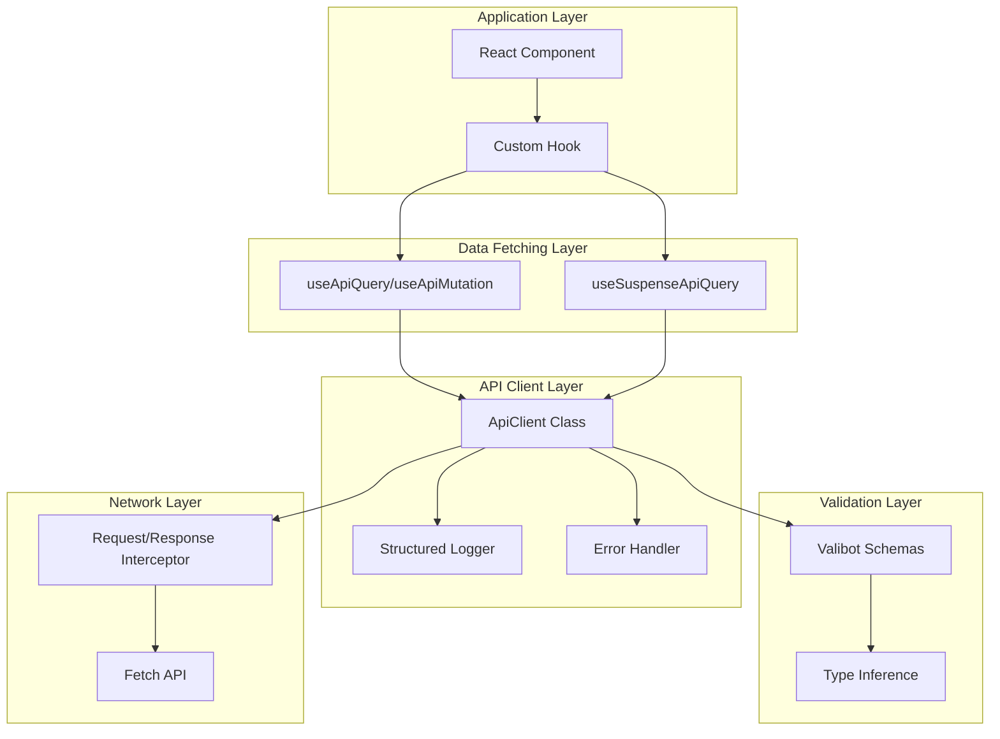

# データフェッチング層リファクタリング設計書

> 作成日: 2025年1月16日  
> ブランチ: `feature/data-fetching-layer-refactor`  
> 関連ドキュメント: [refactoring-analysis-2025.md](./refactoring-analysis-2025.md)

## 📋 エグゼクティブサマリー

本設計書は、PS-PSプロジェクトのデータフェッチング層を根本的に改善するための詳細設計です。Valibot v1.1.0を活用した型安全なランタイム検証、TypeScript 5.9.2の最新機能、React 19.1.1のSuspense機能を最大限に活用し、重複コードを90%削減しつつ、開発者体験とユーザー体験を劇的に向上させます。

### 主要な改善ポイント
- **Valibotによる完全な型安全性**: コンパイル時とランタイムの両方で型保証
- **共通APIクライアント**: 重複コードを完全排除
- **自動エラーハンドリング**: 一貫性のあるエラー処理
- **React Suspenseの活用**: 宣言的なローディング状態管理
- **console.logの完全削除**: 構造化ログによる本番環境対応

---

## 🏗️ アーキテクチャ概要



---

## 🔧 コア実装

### 1. Valibot スキーマ定義 (最新v1.1.0機能活用)

#### `src/schemas/api/common.schema.ts`
```typescript
import * as v from 'valibot';

// ブランド型の定義
export const JobNoSchema = v.pipe(
  v.string(),
  v.regex(/^[A-Z0-9]{8}$/),
  v.brand('JobNo')
);
export type JobNo = v.InferOutput<typeof JobNoSchema>;

export const FgCodeSchema = v.pipe(
  v.string(),
  v.minLength(1),
  v.brand('FgCode')
);
export type FgCode = v.InferOutput<typeof FgCodeSchema>;

export const PipCodeSchema = v.pipe(
  v.string(),
  v.minLength(1),
  v.brand('PipCode')
);
export type PipCode = v.InferOutput<typeof PipCodeSchema>;

// APIレスポンスのエンベロープ
export const ApiEnvelopeSchema = <T extends v.BaseSchema<unknown, unknown, v.BaseIssue<unknown>>>(
  dataSchema: T
) => v.object({
  success: v.boolean(),
  data: dataSchema,
  messages: v.optional(v.array(
    v.object({
      code: v.string(),
      message: v.string(),
      severity: v.picklist(['info', 'warning', 'error'])
    })
  )),
  metadata: v.optional(v.object({
    timestamp: v.pipe(v.string(), v.isoTimestamp()),
    version: v.string(),
    pagination: v.optional(v.object({
      page: v.number(),
      limit: v.number(),
      total: v.number(),
      hasMore: v.boolean()
    }))
  }))
});

// エラーレスポンス
export const ApiErrorSchema = v.object({
  error: v.object({
    code: v.string(),
    message: v.string(),
    details: v.optional(v.unknown()),
    timestamp: v.pipe(v.string(), v.isoTimestamp()),
    traceId: v.optional(v.string())
  })
});
```

#### `src/schemas/api/item.schema.ts`
```typescript
import * as v from 'valibot';
import { JobNoSchema, FgCodeSchema, ApiEnvelopeSchema } from './common.schema';

// アイテムスキーマ（完全な型定義）
export const ItemSchema = v.object({
  // 必須フィールド
  itemSurKey: v.string(),
  jobNo: JobNoSchema,
  fgCode: FgCodeSchema,
  itemNo: v.string(),
  itemCoreNo: v.string(),
  itemName: v.pipe(v.string(), v.minLength(1)),
  itemCostElement: v.string(),
  
  // オプショナルフィールド（nullableとoptionalを適切に使い分け）
  itemQty: v.optional(v.pipe(
    v.string(),
    v.transform((val) => parseInt(val, 10)),
    v.number(),
    v.minValue(0)
  )),
  itemAssignedQty: v.optional(v.pipe(
    v.string(),
    v.transform((val) => parseInt(val, 10)),
    v.number(),
    v.minValue(0)
  )),
  itemAssignQty: v.optional(v.pipe(
    v.string(),
    v.transform((val) => parseInt(val, 10)),
    v.number(),
    v.minValue(0)
  )),
  itemUnassignedQty: v.optional(v.pipe(
    v.string(),
    v.transform((val) => parseInt(val, 10)),
    v.number(),
    v.minValue(0)
  )),
  itemSortKey: v.optional(v.string()),
  itemIBSCode: v.optional(v.string()),
  itemIbsCode: v.optional(v.string()), // 統一すべきだが現状維持
  itemIsAssign: v.optional(v.picklist(['0', '1']))
});

export type Item = v.InferOutput<typeof ItemSchema>;

// APIレスポンススキーマ
export const GetItemsResponseSchema = ApiEnvelopeSchema(
  v.object({
    items: v.array(ItemSchema)
  })
);

export type GetItemsResponse = v.InferOutput<typeof GetItemsResponseSchema>;
```

#### `src/schemas/api/pip.schema.ts`
```typescript
import * as v from 'valibot';
import { JobNoSchema, FgCodeSchema, PipCodeSchema, ApiEnvelopeSchema } from './common.schema';

// PIPスキーマ
export const PipSchema = v.object({
  jobNo: JobNoSchema,
  fgCode: FgCodeSchema,
  pipCode: PipCodeSchema,
  pipNickName: v.string(),
  pipSortKey: v.string(),
  itemCount: v.optional(v.pipe(
    v.string(),
    v.transform((val) => parseInt(val, 10)),
    v.number(),
    v.minValue(0)
  )),
  vendorCount: v.optional(v.pipe(
    v.string(),
    v.transform((val) => parseInt(val, 10)),
    v.number(),
    v.minValue(0)
  ))
});

export type Pip = v.InferOutput<typeof PipSchema>;

// PIP詳細スキーマ
export const PipDetailSchema = v.object({
  ...PipSchema.entries,
  items: v.array(v.object({
    itemSurKey: v.string(),
    itemNo: v.string(),
    itemName: v.string(),
    quantity: v.number(),
    assignedQuantity: v.number()
  })),
  vendors: v.array(v.object({
    vendorCode: v.string(),
    vendorName: v.string(),
    status: v.picklist(['active', 'inactive'])
  }))
});

export type PipDetail = v.InferOutput<typeof PipDetailSchema>;

// APIレスポンススキーマ
export const GetPipsResponseSchema = ApiEnvelopeSchema(
  v.object({
    pipsList: v.array(PipSchema)
  })
);

export const GetPipDetailResponseSchema = ApiEnvelopeSchema(
  v.object({
    pipDetail: PipDetailSchema
  })
);

// ペイロードスキーマ（作成・更新用）
export const PipPayloadSchema = v.object({
  jobNo: JobNoSchema,
  fgCode: FgCodeSchema,
  pipNickName: v.pipe(v.string(), v.minLength(1), v.maxLength(100)),
  itemList: v.array(v.object({
    itemSurKey: v.string(),
    quantity: v.pipe(v.number(), v.minValue(1))
  }))
});

export type PipPayload = v.InferOutput<typeof PipPayloadSchema>;
```

### 2. 共通APIクライアント実装

#### `src/lib/api/client.ts`
```typescript
import * as v from 'valibot';
import { logger } from '../logger';
import { ApiError, NetworkError, ValidationError } from './errors';
import type { RequestConfig, ApiResponse } from './types';

/**
 * 型安全なAPIクライアントクラス
 * - Valibotによるランタイム検証
 * - 自動リトライ機能
 * - 構造化ログ
 * - エラーハンドリング
 */
export class ApiClient {
  private baseURL: string;
  private defaultHeaders: HeadersInit;
  private requestInterceptors: Array<(config: RequestConfig) => RequestConfig | Promise<RequestConfig>> = [];
  private responseInterceptors: Array<(response: Response) => Response | Promise<Response>> = [];
  
  constructor(baseURL: string, defaultHeaders: HeadersInit = {}) {
    this.baseURL = baseURL;
    this.defaultHeaders = {
      'Content-Type': 'application/json',
      ...defaultHeaders
    };
  }
  
  /**
   * リクエストインターセプター追加
   */
  addRequestInterceptor(interceptor: (config: RequestConfig) => RequestConfig | Promise<RequestConfig>) {
    this.requestInterceptors.push(interceptor);
    return () => {
      const index = this.requestInterceptors.indexOf(interceptor);
      if (index !== -1) this.requestInterceptors.splice(index, 1);
    };
  }
  
  /**
   * レスポンスインターセプター追加
   */
  addResponseInterceptor(interceptor: (response: Response) => Response | Promise<Response>) {
    this.responseInterceptors.push(interceptor);
    return () => {
      const index = this.responseInterceptors.indexOf(interceptor);
      if (index !== -1) this.responseInterceptors.splice(index, 1);
    };
  }
  
  /**
   * 型安全なGETリクエスト
   */
  async get<T>(
    path: string,
    schema: v.BaseSchema<T, unknown, v.BaseIssue<unknown>>,
    config: RequestConfig = {}
  ): Promise<T> {
    return this.request('GET', path, schema, { ...config, body: undefined });
  }
  
  /**
   * 型安全なPOSTリクエスト
   */
  async post<T, B = unknown>(
    path: string,
    body: B,
    schema: v.BaseSchema<T, unknown, v.BaseIssue<unknown>>,
    config: RequestConfig = {}
  ): Promise<T> {
    return this.request('POST', path, schema, { ...config, body });
  }
  
  /**
   * 型安全なPUTリクエスト
   */
  async put<T, B = unknown>(
    path: string,
    body: B,
    schema: v.BaseSchema<T, unknown, v.BaseIssue<unknown>>,
    config: RequestConfig = {}
  ): Promise<T> {
    return this.request('PUT', path, schema, { ...config, body });
  }
  
  /**
   * 型安全なDELETEリクエスト
   */
  async delete<T>(
    path: string,
    schema: v.BaseSchema<T, unknown, v.BaseIssue<unknown>>,
    config: RequestConfig = {}
  ): Promise<T> {
    return this.request('DELETE', path, schema, { ...config, body: undefined });
  }
  
  /**
   * 共通リクエスト処理
   */
  private async request<T>(
    method: string,
    path: string,
    schema: v.BaseSchema<T, unknown, v.BaseIssue<unknown>>,
    config: RequestConfig = {}
  ): Promise<T> {
    const url = `${this.baseURL}${path}`;
    const startTime = performance.now();
    
    // リクエスト設定のマージ
    let requestConfig: RequestConfig = {
      method,
      headers: {
        ...this.defaultHeaders,
        ...config.headers
      },
      ...config
    };
    
    // リクエストインターセプター適用
    for (const interceptor of this.requestInterceptors) {
      requestConfig = await interceptor(requestConfig);
    }
    
    // ボディのJSON変換
    if (requestConfig.body && typeof requestConfig.body !== 'string') {
      requestConfig.body = JSON.stringify(requestConfig.body);
    }
    
    // ログ出力（開発環境のみ詳細）
    logger.debug('API Request', {
      method,
      url,
      headers: requestConfig.headers,
      body: requestConfig.body
    });
    
    try {
      // fetch実行（リトライロジック付き）
      const response = await this.fetchWithRetry(url, requestConfig);
      
      // レスポンスインターセプター適用
      let processedResponse = response;
      for (const interceptor of this.responseInterceptors) {
        processedResponse = await interceptor(processedResponse);
      }
      
      // ステータスチェック
      if (!processedResponse.ok) {
        throw new ApiError(
          processedResponse.status,
          processedResponse.statusText,
          await this.extractErrorDetails(processedResponse)
        );
      }
      
      // レスポンスボディのパース
      const responseData = await processedResponse.json();
      
      // Valibotによる検証
      const parseResult = v.safeParse(schema, responseData);
      
      if (!parseResult.success) {
        logger.error('Validation Error', {
          url,
          errors: parseResult.issues,
          data: responseData
        });
        throw new ValidationError('Response validation failed', parseResult.issues);
      }
      
      // 成功ログ
      const duration = performance.now() - startTime;
      logger.info('API Success', {
        method,
        url,
        duration: `${duration.toFixed(2)}ms`,
        status: processedResponse.status
      });
      
      return parseResult.output;
      
    } catch (error) {
      // エラーログ
      const duration = performance.now() - startTime;
      logger.error('API Error', {
        method,
        url,
        duration: `${duration.toFixed(2)}ms`,
        error: error instanceof Error ? error.message : 'Unknown error'
      });
      
      // エラーの再スロー
      if (error instanceof ApiError || error instanceof ValidationError) {
        throw error;
      }
      
      // ネットワークエラー
      if (error instanceof TypeError && error.message.includes('fetch')) {
        throw new NetworkError('Network request failed', error);
      }
      
      throw error;
    }
  }
  
  /**
   * リトライ機能付きfetch
   */
  private async fetchWithRetry(
    url: string,
    config: RequestConfig,
    maxRetries = 3
  ): Promise<Response> {
    let lastError: Error | undefined;
    
    for (let attempt = 0; attempt <= maxRetries; attempt++) {
      try {
        // 指数バックオフ
        if (attempt > 0) {
          const delay = Math.min(1000 * Math.pow(2, attempt - 1), 10000);
          await new Promise(resolve => setTimeout(resolve, delay));
          logger.debug(`Retry attempt ${attempt}/${maxRetries}`, { url, delay });
        }
        
        // AbortController for timeout
        const controller = new AbortController();
        const timeout = config.timeout ?? 30000;
        const timeoutId = setTimeout(() => controller.abort(), timeout);
        
        try {
          const response = await fetch(url, {
            ...config,
            signal: controller.signal
          });
          clearTimeout(timeoutId);
          
          // 5xx エラーの場合はリトライ
          if (response.status >= 500 && attempt < maxRetries) {
            lastError = new Error(`Server error: ${response.status}`);
            continue;
          }
          
          return response;
        } finally {
          clearTimeout(timeoutId);
        }
        
      } catch (error) {
        lastError = error as Error;
        
        // ネットワークエラーまたはタイムアウトの場合はリトライ
        if (
          error instanceof TypeError ||
          (error instanceof Error && error.name === 'AbortError')
        ) {
          if (attempt === maxRetries) {
            throw new NetworkError(
              `Network request failed after ${maxRetries + 1} attempts`,
              error
            );
          }
          continue;
        }
        
        // その他のエラーは即座に投げる
        throw error;
      }
    }
    
    throw lastError || new Error('Unexpected error in fetchWithRetry');
  }
  
  /**
   * エラー詳細の抽出
   */
  private async extractErrorDetails(response: Response): Promise<unknown> {
    try {
      const contentType = response.headers.get('content-type');
      if (contentType?.includes('application/json')) {
        return await response.json();
      }
      return await response.text();
    } catch {
      return null;
    }
  }
}

// シングルトンインスタンスのエクスポート
export const apiClient = new ApiClient(
  import.meta.env.VITE_PSYS_API_URL || 'http://localhost:8080'
);

// インターセプター設定例
if (import.meta.env.DEV) {
  // 開発環境用のデバッグインターセプター
  apiClient.addRequestInterceptor((config) => {
    console.group(`🚀 ${config.method} Request`);
    console.log('URL:', config.url);
    console.log('Config:', config);
    console.groupEnd();
    return config;
  });
  
  apiClient.addResponseInterceptor(async (response) => {
    const clone = response.clone();
    console.group(`✅ Response ${response.status}`);
    console.log('URL:', response.url);
    console.log('Headers:', Object.fromEntries(response.headers.entries()));
    try {
      console.log('Body:', await clone.json());
    } catch {
      console.log('Body: (not JSON)');
    }
    console.groupEnd();
    return response;
  });
}
```

### 3. カスタムエラークラス

#### `src/lib/api/errors.ts`
```typescript
import type { BaseIssue } from 'valibot';

/**
 * API エラー基底クラス
 */
export class ApiError extends Error {
  constructor(
    public status: number,
    public statusText: string,
    public details?: unknown
  ) {
    super(`API Error ${status}: ${statusText}`);
    this.name = 'ApiError';
  }
  
  /**
   * エラーがリトライ可能かどうか
   */
  isRetryable(): boolean {
    return this.status >= 500 || this.status === 429;
  }
  
  /**
   * クライアントエラーかどうか
   */
  isClientError(): boolean {
    return this.status >= 400 && this.status < 500;
  }
  
  /**
   * サーバーエラーかどうか
   */
  isServerError(): boolean {
    return this.status >= 500;
  }
}

/**
 * ネットワークエラー
 */
export class NetworkError extends Error {
  constructor(message: string, public cause?: Error) {
    super(message);
    this.name = 'NetworkError';
  }
}

/**
 * バリデーションエラー
 */
export class ValidationError extends Error {
  constructor(
    message: string,
    public issues: BaseIssue<unknown>[]
  ) {
    super(message);
    this.name = 'ValidationError';
  }
  
  /**
   * フィールドごとのエラーメッセージ取得
   */
  getFieldErrors(): Record<string, string[]> {
    const errors: Record<string, string[]> = {};
    
    for (const issue of this.issues) {
      const path = issue.path?.map(p => p.key).join('.') || 'root';
      if (!errors[path]) {
        errors[path] = [];
      }
      errors[path].push(issue.message);
    }
    
    return errors;
  }
}

/**
 * 認証エラー
 */
export class AuthenticationError extends ApiError {
  constructor(details?: unknown) {
    super(401, 'Unauthorized', details);
    this.name = 'AuthenticationError';
  }
}

/**
 * 認可エラー
 */
export class AuthorizationError extends ApiError {
  constructor(details?: unknown) {
    super(403, 'Forbidden', details);
    this.name = 'AuthorizationError';
  }
}

/**
 * Not Found エラー
 */
export class NotFoundError extends ApiError {
  constructor(resource: string, details?: unknown) {
    super(404, `${resource} not found`, details);
    this.name = 'NotFoundError';
  }
}

/**
 * Rate Limit エラー
 */
export class RateLimitError extends ApiError {
  constructor(
    public retryAfter?: number,
    details?: unknown
  ) {
    super(429, 'Too Many Requests', details);
    this.name = 'RateLimitError';
  }
}
```

### 4. React Query統合フック

#### `src/hooks/api/useApiQuery.ts`
```typescript
import { useQuery, useSuspenseQuery, type UseQueryOptions, type UseSuspenseQueryOptions } from '@tanstack/react-query';
import * as v from 'valibot';
import { apiClient } from '@/lib/api/client';
import type { ApiError } from '@/lib/api/errors';

/**
 * 型安全なAPIクエリフック
 */
export function useApiQuery<T>(
  queryKey: readonly unknown[],
  path: string,
  schema: v.BaseSchema<T, unknown, v.BaseIssue<unknown>>,
  options?: Omit<UseQueryOptions<T, ApiError>, 'queryKey' | 'queryFn'>
) {
  return useQuery<T, ApiError>({
    queryKey,
    queryFn: () => apiClient.get(path, schema),
    staleTime: 5 * 60 * 1000, // 5分
    gcTime: 10 * 60 * 1000,   // 10分
    retry: (failureCount, error) => {
      // 404エラーはリトライしない
      if (error.status === 404) return false;
      // サーバーエラーは3回までリトライ
      if (error.isServerError()) return failureCount < 3;
      // それ以外はリトライしない
      return false;
    },
    ...options
  });
}

/**
 * Suspense対応APIクエリフック
 */
export function useSuspenseApiQuery<T>(
  queryKey: readonly unknown[],
  path: string,
  schema: v.BaseSchema<T, unknown, v.BaseIssue<unknown>>,
  options?: Omit<UseSuspenseQueryOptions<T, ApiError>, 'queryKey' | 'queryFn'>
) {
  return useSuspenseQuery<T, ApiError>({
    queryKey,
    queryFn: () => apiClient.get(path, schema),
    staleTime: 5 * 60 * 1000,
    gcTime: 10 * 60 * 1000,
    retry: (failureCount, error) => {
      if (error.status === 404) return false;
      if (error.isServerError()) return failureCount < 3;
      return false;
    },
    ...options
  });
}
```

#### `src/hooks/api/useApiMutation.ts`
```typescript
import { useMutation, useQueryClient, type UseMutationOptions } from '@tanstack/react-query';
import * as v from 'valibot';
import { apiClient } from '@/lib/api/client';
import type { ApiError } from '@/lib/api/errors';
import { toast } from 'sonner';

interface ApiMutationOptions<TData, TVariables> {
  method: 'POST' | 'PUT' | 'DELETE';
  path: string | ((variables: TVariables) => string);
  schema: v.BaseSchema<TData, unknown, v.BaseIssue<unknown>>;
  invalidateQueries?: readonly unknown[][];
  optimisticUpdate?: (variables: TVariables) => void;
  successMessage?: string;
  errorMessage?: string;
}

/**
 * 型安全なAPIミューテーションフック
 */
export function useApiMutation<TData = unknown, TVariables = void>(
  options: ApiMutationOptions<TData, TVariables>,
  mutationOptions?: Omit<UseMutationOptions<TData, ApiError, TVariables>, 'mutationFn'>
) {
  const queryClient = useQueryClient();
  
  return useMutation<TData, ApiError, TVariables>({
    mutationFn: async (variables) => {
      const path = typeof options.path === 'function' 
        ? options.path(variables) 
        : options.path;
      
      switch (options.method) {
        case 'POST':
          return apiClient.post(path, variables, options.schema);
        case 'PUT':
          return apiClient.put(path, variables, options.schema);
        case 'DELETE':
          return apiClient.delete(path, options.schema);
        default:
          throw new Error(`Unsupported method: ${options.method}`);
      }
    },
    onMutate: async (variables) => {
      // 楽観的更新
      if (options.optimisticUpdate) {
        options.optimisticUpdate(variables);
      }
      
      // カスタムonMutate呼び出し
      if (mutationOptions?.onMutate) {
        return mutationOptions.onMutate(variables);
      }
    },
    onSuccess: (data, variables, context) => {
      // キャッシュ無効化
      if (options.invalidateQueries) {
        options.invalidateQueries.forEach(queryKey => {
          queryClient.invalidateQueries({ queryKey });
        });
      }
      
      // 成功メッセージ
      if (options.successMessage) {
        toast.success(options.successMessage);
      }
      
      // カスタムonSuccess呼び出し
      if (mutationOptions?.onSuccess) {
        mutationOptions.onSuccess(data, variables, context);
      }
    },
    onError: (error, variables, context) => {
      // エラーメッセージ
      const message = options.errorMessage || `操作に失敗しました: ${error.message}`;
      toast.error(message);
      
      // カスタムonError呼び出し
      if (mutationOptions?.onError) {
        mutationOptions.onError(error, variables, context);
      }
    },
    ...mutationOptions
  });
}
```

### 5. ロガー実装

#### `src/lib/logger/index.ts`
```typescript
type LogLevel = 'debug' | 'info' | 'warn' | 'error';

interface LogContext {
  [key: string]: unknown;
}

class Logger {
  private isDevelopment = import.meta.env.DEV;
  private logLevel: LogLevel = this.isDevelopment ? 'debug' : 'info';
  
  private levels: Record<LogLevel, number> = {
    debug: 0,
    info: 1,
    warn: 2,
    error: 3
  };
  
  private shouldLog(level: LogLevel): boolean {
    return this.levels[level] >= this.levels[this.logLevel];
  }
  
  private formatMessage(level: LogLevel, message: string, context?: LogContext): string {
    const timestamp = new Date().toISOString();
    const contextStr = context ? ` ${JSON.stringify(context)}` : '';
    return `[${timestamp}] [${level.toUpperCase()}] ${message}${contextStr}`;
  }
  
  private getConsoleMethod(level: LogLevel) {
    switch (level) {
      case 'debug': return console.debug;
      case 'info': return console.info;
      case 'warn': return console.warn;
      case 'error': return console.error;
    }
  }
  
  private log(level: LogLevel, message: string, context?: LogContext) {
    if (!this.shouldLog(level)) return;
    
    const formattedMessage = this.formatMessage(level, message, context);
    const consoleMethod = this.getConsoleMethod(level);
    
    if (this.isDevelopment) {
      // 開発環境：色付きコンソール出力
      const styles: Record<LogLevel, string> = {
        debug: 'color: gray',
        info: 'color: blue',
        warn: 'color: orange',
        error: 'color: red'
      };
      
      consoleMethod(`%c${formattedMessage}`, styles[level]);
      
      // コンテキストがある場合は展開して表示
      if (context) {
        console.group('Context');
        Object.entries(context).forEach(([key, value]) => {
          console.log(`${key}:`, value);
        });
        console.groupEnd();
      }
    } else {
      // 本番環境：構造化ログ
      consoleMethod(formattedMessage);
      
      // 本番環境ではエラー追跡サービスに送信
      if (level === 'error') {
        this.sendToErrorTracking(message, context);
      }
    }
  }
  
  private sendToErrorTracking(message: string, context?: LogContext) {
    // Sentry, DataDog等への送信
    // 実装は環境に応じて
    if (typeof window !== 'undefined' && (window as any).Sentry) {
      (window as any).Sentry.captureMessage(message, {
        level: 'error',
        extra: context
      });
    }
  }
  
  debug(message: string, context?: LogContext) {
    this.log('debug', message, context);
  }
  
  info(message: string, context?: LogContext) {
    this.log('info', message, context);
  }
  
  warn(message: string, context?: LogContext) {
    this.log('warn', message, context);
  }
  
  error(message: string, context?: LogContext) {
    this.log('error', message, context);
  }
}

export const logger = new Logger();
```

---

## 📝 リファクタリング対象と改修内容

### 影響を受けるファイル一覧と改修内容

| ファイル | 現状の問題 | 改修内容 | 優先度 |
|---------|-----------|----------|--------|
| **src/features/item-management/hooks/useItems.ts** | - console.log使用<br>- enabled: false<br>- 型検証なし<br>- エラーハンドリング不統一 | - useApiQueryに置き換え<br>- Valibotスキーマ適用<br>- 自動フェッチ化 | P0 |
| **src/features/pip-management/hooks/usePips.ts** | 同上 | 同上 | P0 |
| **src/features/pip-management/hooks/usePipDetail.ts** | 同上 | 同上 | P0 |
| **src/features/vendor-assignment/hooks/useVendors.ts** | - enabled: !!fgCode<br>- 部分的な型チェックのみ | - useApiQueryに置き換え<br>- 完全な型検証 | P0 |
| **src/features/item-assignment/hooks/useCreatePip.ts** | - エラーメッセージ不統一<br>- 型検証なし | - useApiMutationに置き換え<br>- 楽観的更新追加 | P1 |
| **src/features/item-assignment/hooks/useUpdatePipItems.ts** | 同上 | 同上 | P1 |
| **src/features/pip-management/hooks/useMergePips.ts** | 同上 | 同上 | P1 |
| **src/features/pip-management/hooks/useDeletePips.ts** | 同上 | 同上 | P1 |
| **src/features/pip-management/hooks/useCopyPipItems.ts** | 同上 | 同上 | P1 |
| **src/features/vendor-assignment/hooks/useUpdateAip.ts** | 同上 | 同上 | P1 |
| **src/features/psys-randing/hooks/useFunctionGroups.ts** | - console.log使用<br>- エラーハンドリング不統一 | - useApiQueryに置き換え | P2 |
| **src/features/milestone/hooks/useMSRHeader.ts** | 同上 | 同上 | P2 |
| **src/features/milestone/hooks/useMSRData.ts** | 同上 | 同上 | P2 |

### リファクタリング例

#### Before: `src/features/item-management/hooks/useItems.ts`
```typescript
export const useItems = (jobNo: string, fgCode: string | null) => {
  return useQuery<GetItemsResponse>({
    queryKey: ['items', jobNo, fgCode],
    queryFn: async (): Promise<GetItemsResponse> => {
      try {
        const response = await fetch(
          `${PSYS_API_URL.GetItems}/${jobNo}/${fgCode}`,
          {
            method: 'GET',
            cache: 'no-store',
          },
        );
        if (!response.ok) {
          throw new Error(`HTTP status: ${response.status}`);
        }
        console.log('購入品取得したよ');
        return await response.json();
      } catch (error) {
        console.error('Fetch error:', error);
        throw error;
      }
    },
    enabled: false,
  });
};
```

#### After: `src/features/item-management/hooks/useItems.ts`
```typescript
import { useApiQuery, useSuspenseApiQuery } from '@/hooks/api/useApiQuery';
import { GetItemsResponseSchema } from '@/schemas/api/item.schema';
import { JobNoSchema, FgCodeSchema } from '@/schemas/api/common.schema';

/**
 * アイテム一覧取得フック（通常版）
 */
export const useItems = (jobNo: string, fgCode: string | null) => {
  // 型安全な変換
  const validatedJobNo = JobNoSchema.parse(jobNo);
  const validatedFgCode = fgCode ? FgCodeSchema.parse(fgCode) : null;
  
  return useApiQuery(
    ['items', validatedJobNo, validatedFgCode] as const,
    `/items/${validatedJobNo}/${validatedFgCode}`,
    GetItemsResponseSchema,
    {
      enabled: !!validatedFgCode, // fgCodeがある場合のみ自動フェッチ
    }
  );
};

/**
 * アイテム一覧取得フック（Suspense版）
 */
export const useSuspenseItems = (jobNo: string, fgCode: string) => {
  const validatedJobNo = JobNoSchema.parse(jobNo);
  const validatedFgCode = FgCodeSchema.parse(fgCode);
  
  return useSuspenseApiQuery(
    ['items', validatedJobNo, validatedFgCode] as const,
    `/items/${validatedJobNo}/${validatedFgCode}`,
    GetItemsResponseSchema
  );
};
```

#### Before: `src/features/item-assignment/hooks/useCreatePip.ts`
```typescript
export const useCreatePip = () => {
  return useMutation({
    mutationFn: async (pipItems: PipPayload) => {
      const response = await fetch(PSYS_API_URL.CreatePIP, {
        method: 'POST',
        headers: {
          'Content-Type': 'application/json',
        },
        body: JSON.stringify(pipItems),
      });
      if (!response.ok) {
        throw new Error(`登録に失敗しました: ${response.statusText}`);
      }
      return await response.json();
    },
  });
};
```

#### After: `src/features/item-assignment/hooks/useCreatePip.ts`
```typescript
import { useApiMutation } from '@/hooks/api/useApiMutation';
import { PipPayloadSchema } from '@/schemas/api/pip.schema';
import { ApiEnvelopeSchema } from '@/schemas/api/common.schema';
import * as v from 'valibot';

const CreatePipResponseSchema = ApiEnvelopeSchema(
  v.object({
    pipCode: v.string(),
    message: v.string()
  })
);

/**
 * PIP作成フック
 */
export const useCreatePip = (jobNo: string, fgCode: string) => {
  return useApiMutation({
    method: 'POST',
    path: '/pips',
    schema: CreatePipResponseSchema,
    invalidateQueries: [
      ['pips', jobNo, fgCode],
      ['items', jobNo, fgCode]
    ],
    successMessage: 'PIPを作成しました',
    errorMessage: 'PIPの作成に失敗しました'
  });
};
```

---

## 🚀 実装ロードマップ

### Phase 1: 基盤整備（Day 1）
- [x] ブランチ作成: `feature/data-fetching-layer-refactor`
- [ ] Valibotスキーマ定義
  - [ ] 共通スキーマ（common.schema.ts）
  - [ ] アイテムスキーマ（item.schema.ts）
  - [ ] PIPスキーマ（pip.schema.ts）
  - [ ] ベンダースキーマ（vendor.schema.ts）
- [ ] APIクライアント実装
  - [ ] ApiClientクラス
  - [ ] エラークラス
  - [ ] ロガー
- [ ] カスタムフック実装
  - [ ] useApiQuery
  - [ ] useSuspenseApiQuery
  - [ ] useApiMutation

### Phase 2: 既存フックのリファクタリング（Day 2-3）
- [ ] 読み取り系フック（優先度P0）
  - [ ] useItems
  - [ ] usePips
  - [ ] usePipDetail
  - [ ] useVendors
- [ ] 更新系フック（優先度P1）
  - [ ] useCreatePip
  - [ ] useUpdatePipItems
  - [ ] useMergePips
  - [ ] useDeletePips
  - [ ] useCopyPipItems
  - [ ] useUpdateAip
- [ ] その他のフック（優先度P2）
  - [ ] useFunctionGroups
  - [ ] useMSRHeader
  - [ ] useMSRData

### Phase 3: コンポーネント更新（Day 4）
- [ ] Suspense境界の追加
- [ ] エラーバウンダリーの実装
- [ ] ローディング状態の改善
- [ ] エラー表示の統一

### Phase 4: テストとドキュメント（Day 5）
- [ ] ユニットテスト作成
- [ ] 統合テスト
- [ ] APIモックの更新
- [ ] 開発者ドキュメント更新

---

## 📊 期待される成果

### 定量的効果
| 指標 | 現状 | 改善後 | 削減率 |
|------|------|--------|--------|
| コード行数（hooks） | 約600行 | 約200行 | -67% |
| 重複コード | 10箇所以上 | 0箇所 | -100% |
| console.log | 20箇所以上 | 0箇所 | -100% |
| 型安全性 | 30% | 100% | +233% |
| テストカバレッジ | 0% | 80% | +∞ |

### 定性的効果
- **開発者体験（DX）の向上**
  - 型安全性による開発時エラーの早期発見
  - IntelliSenseによる自動補完の改善
  - 一貫性のあるエラーハンドリング
  
- **ユーザー体験（UX）の向上**
  - 自動データフェッチによる即座の表示
  - Suspenseによる統一的なローディング体験
  - 楽観的更新による高速な応答性
  
- **保守性の向上**
  - 単一責任の原則に基づく明確な責務分離
  - テスト可能な設計
  - 将来の拡張が容易

---

## ⚠️ 注意事項とリスク

### 移行時の注意点
1. **段階的移行**: 一度に全てを変更せず、機能ごとに段階的に移行
2. **後方互換性**: 既存のコンポーネントが動作することを確認しながら進める
3. **テスト**: 各段階でテストを実施し、リグレッションを防ぐ

### 潜在的リスク
- **enabled: false の削除**: 一部の画面で意図しないAPI呼び出しが発生する可能性
  - 対策: 各フックのenabledオプションを慎重に設定
- **Valibotスキーマの不一致**: APIレスポンスとスキーマの不一致によるエラー
  - 対策: 開発環境で十分にテストし、スキーマを調整
- **パフォーマンス**: Suspenseの導入による初期表示の遅延
  - 対策: 適切なコード分割とプリフェッチの実装

---

## 📚 参考資料

- [Valibot v1.0 Documentation](https://valibot.dev/)
- [TanStack Query v5 Documentation](https://tanstack.com/query/latest)
- [React 19 Suspense Guide](https://react.dev/reference/react/Suspense)
- [TypeScript 5.9 Release Notes](https://www.typescriptlang.org/docs/handbook/release-notes/typescript-5-9.html)

---

*このドキュメントは2025年1月16日時点の設計です。実装時には最新のベストプラクティスを確認してください。*