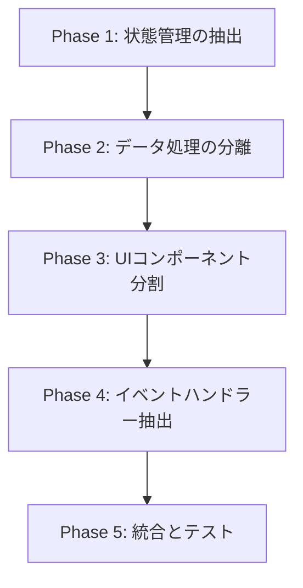

# MilestoneGrid コンポーネント分割戦略

## 現状分析

### 問題点
- **ファイルサイズ**: 384行の巨大コンポーネント
- **責務過多**: データ取得、状態管理、UI表示、イベント処理、グリッド初期化など多数の責務を持つ
- **複雑な依存関係**: 7つのカスタムストア、5つのカスタムフック、Wijmoライブラリへの密結合
- **テスタビリティの低さ**: 多数の副作用と複雑な状態管理により単体テストが困難

### 主な機能領域
1. データ取得とページング処理
2. グリッドの初期化と設定
3. PIP/AIPデータの管理
4. ベンダー選択ダイアログ
5. CollectionViewの管理
6. エラーハンドリングとローディング状態

## 段階的分割戦略

### Phase 1: 状態管理の抽出 (Week 1)
目標: 複雑な状態管理ロジックを専用フックに移動

#### 1.1 `useMilestoneGridState.ts`
```typescript
// 抽出する状態
- MSRHeader, setMSRHeader
- MSRData, setMSRData
- columnGroups, setColumnGroups
- skipNum, setSkipNum
- isLoading, setIsLoading
- assignedVendorCode, setAssignedVendorCode
- wijmoUpdateMode, setWijmoUpdateMode
```

#### 1.2 `useMilestoneCollectionView.ts`
```typescript
// CollectionView関連のロジック
- CollectionViewの生成
- グルーピング設定
- データ変換（transformToMilestoneData）
- 位置の保持と復元
```

### Phase 2: データ処理ロジックの分離 (Week 2)
目標: データ取得と変換ロジックを独立したモジュールに

#### 2.1 `MilestoneDataService.ts`
```typescript
// データ取得と管理
- refreshGroupData メソッド
- handleAssignVendors メソッド
- データのフィルタリングとマージ処理
```

#### 2.2 `MilestoneGridConfig.ts`
```typescript
// グリッド設定の定数化
- LOAD_MORE_THRESHOLD
- ライセンスキー設定
- デフォルトのグリッド設定値
```

### Phase 3: UIコンポーネントの分割 (Week 3)
目標: 表示ロジックを小さなコンポーネントに分解

#### 3.1 `MilestoneGridLoader.tsx`
```typescript
// ローディング表示
interface Props {
  isLoading: boolean;
}
```

#### 3.2 `MilestoneGridError.tsx`
```typescript
// エラー表示
interface Props {
  error: Error | null;
  MSRMngCode: string | null;
}
```

#### 3.3 `MilestoneGridContent.tsx`
```typescript
// グリッド本体の表示
interface Props {
  collectionView: wjcCore.CollectionView;
  columnGroups: ColumnDefinition[];
  gridRef: React.RefObject<FlexGrid>;
  initializeGrid: (grid: FlexGrid) => void;
}
```

### Phase 4: イベントハンドラーの抽出 (Week 4)
目標: すべてのイベントハンドラーを専用フックに移動

#### 4.1 `useMilestoneGridHandlers.ts`
```typescript
// イベントハンドラーの集約
- updateGridMetrics
- グリッドのスクロールイベント
- セルクリックイベント
- データ更新イベント
```

### Phase 5: 最終統合とテスト追加 (Week 5)
目標: リファクタリング後のコンポーネントを統合し、テストを追加

#### 5.1 最終的なファイル構造
```
src/features/milestone/
├── components/
│   ├── MilestoneGrid/
│   │   ├── index.tsx                    // メインコンポーネント（50行以下）
│   │   ├── MilestoneGridContent.tsx     // グリッド表示
│   │   ├── MilestoneGridLoader.tsx      // ローディング
│   │   ├── MilestoneGridError.tsx       // エラー表示
│   │   └── types.ts                     // 型定義
│   ├── hooks/
│   │   ├── useMilestoneGridState.ts     // 状態管理
│   │   ├── useMilestoneCollectionView.ts // CollectionView管理
│   │   ├── useMilestoneGridHandlers.ts  // イベントハンドラー
│   │   └── useMilestoneDataService.ts   // データ処理
│   ├── services/
│   │   └── MilestoneDataService.ts      // データ操作ロジック
│   └── config/
│       └── MilestoneGridConfig.ts       // 設定値
```

## 実装順序と依存関係



## 各フェーズの成功基準

### Phase 1
- [ ] 状態管理が独立したフックに移動
- [ ] 元のコンポーネントが100行削減

### Phase 2
- [ ] データ処理ロジックが独立
- [ ] 元のコンポーネントがさらに50行削減

### Phase 3
- [ ] UIが3つ以上の小コンポーネントに分割
- [ ] 各コンポーネントが50行以下

### Phase 4
- [ ] すべてのイベントハンドラーが抽出済み
- [ ] メインコンポーネントが100行以下

### Phase 5
- [ ] すべてのコンポーネントにテスト追加
- [ ] 元の機能が完全に保持されている

## リスクと対策

### リスク1: Wijmoライブラリとの密結合
**対策**: Wijmo関連のロジックは専用のラッパーコンポーネントを作成し、段階的に抽象化

### リスク2: 既存機能の破壊
**対策**: 各フェーズごとに機能テストを実施し、リグレッションを防ぐ

### リスク3: パフォーマンスの劣化
**対策**: React.memo, useMemoを適切に使用し、不要な再レンダリングを防ぐ

## 推定工数

| Phase | 工数 | 難易度 |
|-------|------|--------|
| Phase 1 | 2日 | 中 |
| Phase 2 | 2日 | 高 |
| Phase 3 | 3日 | 低 |
| Phase 4 | 2日 | 中 |
| Phase 5 | 3日 | 中 |
| **合計** | **12日** | - |

## 次のステップ

1. この戦略のレビューと承認
2. Phase 1の詳細設計書作成
3. 各フェーズ用のブランチ戦略決定
4. テスト戦略の詳細化

## 備考

- 各フェーズは独立してデプロイ可能とする
- 既存の機能を維持しながら段階的に移行
- 各フェーズ完了後にコードレビューを実施
- パフォーマンス測定を各フェーズで実施