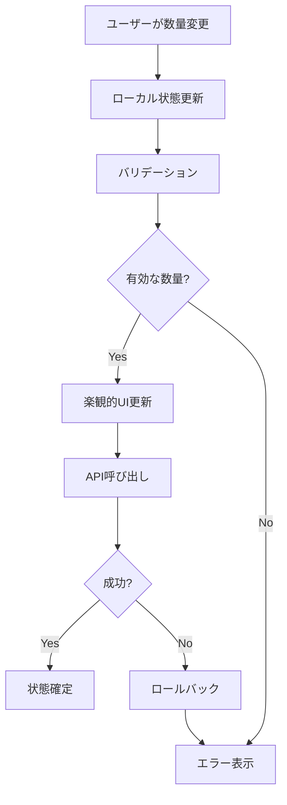

# No.21 PIP編集時の未割当数量による数量増加対応 - 実装計画書

> 作成日: 2025年1月14日  
> 更新日: 2025年1月14日 - 数量計算ロジックの修正  
> 対象バグ: No.21 - Edit PIPで未割当数量がある時のQty増加対応  
> ブランチ: `feature/no21-pip-edit-qty-increase`  
> ステータス: 計画フェーズ

## 📋 エグゼクティブサマリー

本ドキュメントは、PIP編集時に未割当数量（Unassigned Qty）が存在するアイテムに対して、数量を増やせるようにする機能改善の詳細実装計画です。現在の仕様では、PIP編集時にアイテムの数量は減少のみ可能ですが、未割当数量がある場合は、その範囲内で数量を増やせるように改修します。

**重要な計算式**: `未割当数量 = 総数量(itemQty) - 割当済み数量(itemAssignedQty)`

**UIの改善**: shadcn/ui Comboboxコンポーネントを採用し、従来の「+/-ボタン + 入力フィールド」方式から、よりシンプルで直感的な「検索可能なドロップダウン」方式に変更します。これにより、プリセット値の選択と直接入力の両方に対応し、ユーザビリティを大幅に向上させます。

## 🎯 改修目標

### 主要目標
1. **数量増加機能の実装**: 未割当数量の範囲内で、PIP編集時にアイテム数量を増やせるようにする
2. **ユーザビリティ向上**: 直感的なUIで利用可能な最大数量を明示
3. **データ整合性確保**: リアルタイムで未割当数量を計算し、他のPIPとの競合を防ぐ

### 成功指標
- PIP編集時に未割当数量がある場合、その範囲内で数量増加が可能
- UIに最大割当可能数量が明確に表示される
- 数量変更時のバリデーションが適切に動作する
- 他のPIPとの数量競合が発生しない

## 🔍 現状分析

### 現在の実装状況

#### データモデル
```typescript
// src/types/common.ts
interface Item {
  itemSurKey: number;
  itemNo: string;
  itemName: string;
  itemQty?: number;           // 総数量
  itemAssignedQty: number;     // 割当済み数量
  itemUnassignedQty?: number;  // 未割当数量
  // ...
}

// src/features/item-assignment/types/pip-api.ts
interface PipDraftItem {
  itemSurKey: number;
  itemAssignQty: number;  // PIPに割り当てる数量
}
```

#### 現在の問題点
1. **数量制限ロジック**: 現在のPIPに割り当てられている数量以下にしか設定できない
2. **未割当数量の未活用**: 未割当数量は`itemQty - itemAssignedQty`で計算可能だが、編集時に考慮されていない
3. **UIフィードバック不足**: 利用可能な最大数量が表示されない
4. **動的計算の欠如**: 未割当数量を動的に計算して利用する仕組みがない

### 技術的制約と考慮事項
- 未割当数量は`itemQty`と`itemAssignedQty`から動的に計算する
- `itemUnassignedQty`フィールドはオプショナルで、計算値として扱う
- リアルタイム性を保つため、編集中の他ユーザーとの競合を考慮
- 既存のPIP編集APIとの互換性維持
- 現在編集中のPIPの割当量を考慮した計算が必要

## 💡 解決方針

### UIコンポーネントの選定 - shadcn/ui Combobox

#### なぜshadcn/ui Comboboxを選択するか

1. **シンプルで直感的なUI**
   - ドロップダウンと検索入力を統合した単一のコントロール
   - 数値の直接入力とプリセット選択の両方に対応
   - 従来の「+/-ボタン + 入力フィールド」より省スペース

2. **優れたユーザビリティ**
   - キーボード操作完全対応（↑↓でナビゲート、Enterで選択）
   - 検索による素早い値の入力
   - モバイルフレンドリーなタッチ操作

3. **豊富な情報表示**
   - 各選択肢に説明文を追加可能
   - バッジで推奨値や警告を視覚的に表示
   - 現在値、最大値、未割当数量を一覧で確認

4. **実装の容易さ**
   - Radix UIベースの堅牢な実装
   - アクセシビリティ標準準拠（ARIA対応）
   - カスタマイズが容易なコンポーネント構造

### 重要な計算式と概念

#### 基本計算式
```
未割当数量 = 総数量(itemQty) - 全体の割当済み数量(itemAssignedQty)
```

#### PIP編集時の最大割当可能数量
```
最大割当可能数量 = 現在のPIPの割当量 + 未割当数量
                = currentPipAssignedQty + (itemQty - itemAssignedQty)
```

#### 割当超過時の処理
```
割当超過 = itemAssignedQty > itemQty の状態
この場合: 未割当数量は負の値となる
対応: 現在のPIP割当量から減らすことのみ可能（増やすことは不可）
```

#### 具体例

**通常ケース（未割当数量がある場合）**:
- アイテムの総数量: 100個
- 全PIPへの割当済み数量: 60個
- 現在編集中のPIPの割当量: 20個
- 未割当数量: 100 - 60 = 40個
- 最大割当可能数量: 20 + 40 = 60個
- 操作: 20個から最大60個まで増減可能

**割当超過ケース**:
- アイテムの総数量: 100個
- 全PIPへの割当済み数量: 120個（超過状態）
- 現在編集中のPIPの割当量: 30個
- 未割当数量: 100 - 120 = -20個（負の値）
- 最大割当可能数量: 30個（現在の割当量が上限）
- 操作: 30個から0個まで減少のみ可能

### アーキテクチャ設計

#### 1. 数量計算ロジックの改善
```typescript
// 新しい数量計算ユーティリティ
class QuantityCalculator {
  // 未割当数量を動的に計算（負の値も許容）
  calculateUnassignedQty(item: Item): number {
    // 総数量 - 割当済み数量 = 未割当数量
    const totalQty = item.itemQty || 0;
    const assignedQty = item.itemAssignedQty || 0;
    return totalQty - assignedQty; // 負の値も返す（割当超過の場合）
  }
  
  // 割当超過状態かどうかを判定
  isOverAllocated(item: Item): boolean {
    return this.calculateUnassignedQty(item) < 0;
  }
  
  // 最大割当可能数量を計算（現在のPIPの割当量を考慮）
  calculateMaxAssignableQty(
    item: Item,
    currentPipQty: number
  ): number {
    const unassignedQty = this.calculateUnassignedQty(item);
    
    // 割当超過の場合は、現在の割当量が上限（減少のみ可能）
    if (unassignedQty < 0) {
      return currentPipQty;
    }
    
    // 通常の場合: 現在のPIP割当量 + 未割当数量
    return currentPipQty + unassignedQty;
  }
  
  // より正確な計算：他のPIPの割当を除外
  calculateMaxAssignableQtyExact(
    item: Item,
    currentPipQty: number,
    allPipAssignments: Map<string, number>
  ): number {
    const totalQty = item.itemQty || 0;
    
    // 他のPIPに割り当てられている数量の合計を計算
    let othersAssignedQty = 0;
    for (const [pipCode, qty] of allPipAssignments) {
      if (pipCode !== currentPipCode) {
        othersAssignedQty += qty;
      }
    }
    
    // 総数量 - 他PIPの割当済み数量 = このPIPで使用可能な最大数量
    return Math.max(0, totalQty - othersAssignedQty);
  }
  
  // 数量変更の妥当性を検証
  validateQtyChange(
    item: Item,
    currentPipQty: number,
    newQty: number
  ): ValidationResult {
    const maxQty = this.calculateMaxAssignableQty(item, currentPipQty);
    const unassignedQty = this.calculateUnassignedQty(item);
    const isOverAllocated = this.isOverAllocated(item);
    
    if (newQty < 0) {
      return { valid: false, message: '数量は0以上である必要があります' };
    }
    
    if (newQty > maxQty) {
      if (isOverAllocated) {
        return { 
          valid: false, 
          message: `割当超過状態のため、現在の数量(${currentPipQty})から減らすことのみ可能です`
        };
      } else {
        return { 
          valid: false, 
          message: `最大割当可能数量は${maxQty}です（未割当: ${unassignedQty}）`
        };
      }
    }
    
    return { valid: true };
  }
}
```

#### 2. React Hook の実装
```typescript
// カスタムフックで数量編集ロジックを管理
const useEditableQuantity = (
  item: Item,
  pipCode: string,
  currentPipAssignedQty: number  // 現在のPIPに既に割り当てられている数量
) => {
  const [currentQty, setCurrentQty] = useState(currentPipAssignedQty);
  const [isDirty, setIsDirty] = useState(false);
  
  const calculator = useMemo(() => new QuantityCalculator(), []);
  
  // 未割当数量を動的に計算
  const unassignedQty = useMemo(() => {
    return calculator.calculateUnassignedQty(item);
  }, [item.itemQty, item.itemAssignedQty, calculator]);
  
  // 割当超過状態の判定
  const isOverAllocated = useMemo(() => {
    return calculator.isOverAllocated(item);
  }, [item, calculator]);
  
  // 最大割当可能数量を計算
  const maxAssignableQty = useMemo(() => {
    return calculator.calculateMaxAssignableQty(item, currentPipAssignedQty);
  }, [item, currentPipAssignedQty, calculator]);
  
  // 利用可能な増加分を計算
  const availableIncrease = useMemo(() => {
    return Math.max(0, maxAssignableQty - currentQty);
  }, [maxAssignableQty, currentQty]);
  
  // 数量変更ハンドラー
  const handleQtyChange = useCallback((newQty: number) => {
    const validation = calculator.validateQtyChange(
      item,
      currentPipAssignedQty,
      newQty
    );
    
    if (validation.valid) {
      setCurrentQty(newQty);
      setIsDirty(newQty !== currentPipAssignedQty);
    } else {
      // エラーメッセージを表示
      console.error(validation.message);
    }
  }, [item, currentPipAssignedQty, calculator]);
  
  return {
    currentQty,
    maxAssignableQty,
    unassignedQty,
    availableIncrease,
    isOverAllocated,
    isDirty,
    handleQtyChange,
    canIncrease: !isOverAllocated && currentQty < maxAssignableQty,
    canDecrease: currentQty > 0
  };
};
```

#### 3. UIコンポーネントの改善

##### 3.1 shadcn/ui Comboboxを使用したシンプルな数量選択UI

```typescript
// shadcn/ui Comboboxを使用した数量選択コンポーネント
import * as React from "react";
import { Check, ChevronsUpDown, AlertCircle, Info } from "lucide-react";
import { cn } from "@/lib/utils";
import { Button } from "@/components/ui/button";
import {
  Command,
  CommandEmpty,
  CommandGroup,
  CommandInput,
  CommandItem,
  CommandList,
} from "@/components/ui/command";
import {
  Popover,
  PopoverContent,
  PopoverTrigger,
} from "@/components/ui/popover";
import { Badge } from "@/components/ui/badge";

interface QuantityOption {
  value: number;
  label: string;
  description?: string;
  variant?: 'default' | 'recommended' | 'warning';
}

// インライン編集バージョン
const QuantityCombobox: React.FC<{
  item: Item;
  currentQty: number;
  maxQty: number;
  onChange: (value: number) => void;
}> = ({ item, currentQty, maxQty, onChange }) => {
  const [open, setOpen] = React.useState(false);
  const unassigned = (item.itemQty || 0) - (item.itemAssignedQty || 0);
  
  // プリセット値を生成
  const presets = React.useMemo(() => {
    const values = new Set([0, currentQty]);
    if (maxQty > currentQty) {
      values.add(Math.floor((currentQty + maxQty) / 2)); // 中間値
      values.add(maxQty); // 最大値
    }
    return Array.from(values).sort((a, b) => a - b);
  }, [currentQty, maxQty]);

  return (
    <Popover open={open} onOpenChange={setOpen}>
      <PopoverTrigger asChild>
        <Button
          variant="ghost"
          size="sm"
          className="h-auto px-2 py-1 font-mono"
        >
          {currentQty}
          <ChevronsUpDown className="ml-1 h-3 w-3" />
        </Button>
      </PopoverTrigger>
      <PopoverContent className="w-[200px] p-2" align="start">
        <div className="grid gap-1">
          {presets.map(value => (
            <Button
              key={value}
              variant={value === currentQty ? "default" : "ghost"}
              size="sm"
              className="justify-start"
              onClick={() => {
                onChange(value);
                setOpen(false);
              }}
            >
              {value}
              {value === 0 && " (解除)"}
              {value === maxQty && value > 0 && " (最大)"}
              {value === currentQty && " (現在)"}
            </Button>
          ))}
        </div>
      </PopoverContent>
    </Popover>
  );
};
```

## 📝 実装タスク詳細

### Phase 1: 基盤準備（1日）

#### 1.1 データモデルの確認と計算ロジック設計
- [ ] `Item`インターフェースの`itemQty`と`itemAssignedQty`フィールドの確認
- [ ] 未割当数量の計算式（`itemQty - itemAssignedQty`）の実装方針決定
- [ ] `itemUnassignedQty`フィールドを計算値として扱う設計の文書化
- [ ] 型定義の更新（必要に応じて計算プロパティの追加）

#### 1.2 ユーティリティ関数の実装
- [ ] `src/features/pip-management/utils/quantityCalculator.ts`の作成
- [ ] `calculateUnassignedQty`関数の実装（動的計算）
- [ ] `calculateMaxAssignableQty`関数の実装（現在のPIP割当量考慮）
- [ ] バリデーション関数の実装
- [ ] ユニットテストの作成（エッジケース含む）

### Phase 2: Hook実装（1日）

#### 2.1 カスタムHookの作成
- [ ] `src/features/pip-management/hooks/useEditableQuantity.ts`の実装
- [ ] 状態管理ロジックの実装
- [ ] 最適化（useMemo, useCallback）の適用

#### 2.2 既存Hookの更新
- [ ] `useUpdatePipItems`フックの改修
- [ ] 数量増加に対応したペイロード生成
- [ ] エラーハンドリングの強化

### Phase 3: UIコンポーネント改修（2日）

#### 3.1 shadcn/ui Combobox関連コンポーネントのインストール
- [ ] 必要なshadcn/uiコンポーネントをインストール
  ```bash
  npx shadcn-ui@latest add popover
  npx shadcn-ui@latest add command
  npx shadcn-ui@latest add badge
  ```
- [ ] 依存関係の確認（cmdk、@radix-ui/react-popover）

#### 3.2 数量編集コンポーネントの作成
- [ ] `src/features/pip-management/components/QuantityCombobox.tsx`の実装
- [ ] アクセシビリティ対応（ARIA属性、キーボード操作）

#### 3.2 PIP詳細画面の改修
- [ ] `PipDetail.tsx`への新コンポーネント統合
- [ ] 既存の数量表示部分を編集可能UIに置き換え
- [ ] リアルタイムバリデーションの実装

### Phase 4: 状態管理の改善（1日）

#### 4.1 楽観的更新の実装
- [ ] TanStack Queryの`optimisticUpdate`設定
- [ ] ローカル状態とサーバー状態の同期
- [ ] ロールバック処理の実装


## 🔧 技術実装詳細

### API統合

#### 必要なAPIエンドポイント
```typescript
// 既存のエンドポイントを活用（改善版）
GET /api/pips/{pipCode}/items
  Response: {
    items: [{
      itemSurKey: number;
      itemQty: number;           // 総数量
      itemAssignedQty: number;   // 全体の割当済み数量
      itemAssignQty: number;     // このPIPへの割当数量
      // itemUnassignedQtyは計算で求める: itemQty - itemAssignedQty
    }]
  }

POST /api/pips/{pipCode}/items/update
  Request: {
    items: [{
      itemSurKey: number;
      itemAssignQty: number; // 新しい数量
    }]
  }
  
  // バックエンドでのバリデーション
  Validation: {
    // 新しい数量が以下の条件を満たすことを確認
    // newQty <= currentPipQty + (itemQty - itemAssignedQty)
  }
```

### 状態管理フロー



### エラーハンドリング

```typescript
enum QuantityErrorCode {
  EXCEEDS_MAX = 'EXCEEDS_MAX',
  NEGATIVE_VALUE = 'NEGATIVE_VALUE',
  CONCURRENT_EDIT = 'CONCURRENT_EDIT',
  API_ERROR = 'API_ERROR'
}

class QuantityError extends Error {
  constructor(
    public code: QuantityErrorCode,
    public message: string,
    public details?: any
  ) {
    super(message);
  }
}
```

## ⚠️ リスクと対策

### 技術的リスク

| リスク | 影響度 | 対策 |
|--------|--------|------|
| 同時編集による競合 | 高 | 楽観的ロックまたは悲観的ロックの実装 |
| APIレスポンスの遅延 | 中 | ローディング状態の適切な表示、タイムアウト設定 |
| 未割当数量の不整合 | 高 | リアルタイムでのデータ再取得、定期的な同期 |
| ブラウザ互換性 | 低 | Polyfillの使用、プログレッシブエンハンスメント |

### ビジネスリスク

| リスク | 影響度 | 対策 |
|--------|--------|------|
| ユーザーの誤操作 | 中 | 確認ダイアログ、Undo機能の実装 |
| データ整合性の破壊 | 高 | トランザクション処理、監査ログ |
| パフォーマンス劣化 | 中 | デバウンス処理、仮想スクロール |

## 📊 テスト計画

### テストシナリオ

#### 正常系テスト
1. **基本的な数量増加**
   - 未割当数量（itemQty - itemAssignedQty）がある場合、その範囲内で増加可能
   - UIに最大値が正しく表示される
   - 更新が正しく保存される

2. **計算ロジックの検証**
   - 通常ケース: `itemQty = 100, itemAssignedQty = 60, currentPipQty = 20` → 最大40まで増加可能
   - 完全割当: `itemQty = 50, itemAssignedQty = 50, currentPipQty = 10` → 減少のみ可能
   - 新規割当: `itemQty = 100, itemAssignedQty = 30, currentPipQty = 0` → 最大70まで設定可能
   - 割当超過: `itemQty = 100, itemAssignedQty = 120, currentPipQty = 30` → 0〜30の範囲で減少のみ可能

3. **境界値テスト**
   - 最小値（0）への変更
   - 最大値（currentPipQty + (itemQty - itemAssignedQty)）への変更
   - 範囲外の値入力時の挙動

#### 異常系テスト
1. **エラーハンドリング**
   - APIエラー時のロールバック
   - ネットワーク切断時の挙動
   - 不正な値入力時のバリデーション

2. **同時編集**
   - 複数ユーザーが同じPIPを編集
   - 未割当数量の競合解決
   - itemAssignedQtyが変更された場合の再計算

### パフォーマンステスト
- 大量アイテム（1000件以上）での動作確認
- 連続的な数量変更時のレスポンス
- メモリリークのチェック

## 📈 成果測定

### KPI設定
- **操作完了率**: 95%以上
- **エラー発生率**: 1%未満
- **平均操作時間**: 30秒以内
- **ユーザー満足度**: 4.5/5.0以上

### モニタリング項目
- API呼び出し回数と成功率
- 数量変更操作の頻度
- エラーログの分析
- ユーザーフィードバック

## 🚀 デプロイ計画

### リリース戦略
1. **開発環境**: 実装完了後即座にデプロイ
2. **ステージング環境**: 1週間のテスト期間
3. **本番環境**: 段階的ロールアウト（10% → 50% → 100%）

### ロールバック計画
- Feature Flagによる機能の有効/無効切り替え
- データベースのバックアップとリストア手順
- 旧バージョンへの切り戻し手順書

## 📅 スケジュール

| フェーズ | タスク | 期間 | 担当者 |
|---------|--------|------|--------|
| Phase 1 | 基盤準備 | 1日 | バックエンド |
| Phase 2 | Hook実装 | 1日 | フロントエンド |
| Phase 3 | UI改修 | 2日 | フロントエンド |
| Phase 4 | 状態管理 | 1日 | フロントエンド |
| Phase 5 | テスト | 2日 | QA |
| Phase 6 | ドキュメント | 1日 | 全員 |
| **合計** | | **8日** | |

## 🎯 次のアクション

1. **技術検証**（今すぐ）
   - APIレスポンスで`itemUnassignedQty`が提供されることを確認
   - 既存のPIP編集フローの詳細調査

2. **プロトタイプ作成**（Day 1-2）
   - 数量編集UIのモックアップ作成
   - 基本的な動作確認

3. **実装開始**（Day 3）
   - Phase 1から順次実装
   - 日次でのコードレビュー

## 📚 参考資料

### 関連ドキュメント
- [critical-bugs-remediation-plan-2025.md](./critical-bugs-remediation-plan-2025.md)
- [requirement.md](./requirement.md)
- [state-management-optimization-strategy.md](./state-management-optimization-strategy.md)

### 技術リファレンス
- [React Hook Form Documentation](https://react-hook-form.com/)
- [TanStack Query Optimistic Updates](https://tanstack.com/query/latest/docs/framework/react/guides/optimistic-updates)
- [Zod Validation Library](https://zod.dev/)

## 📌 更新履歴と重要な変更点

### 2025年1月14日 - 計算ロジックの修正
- **初版作成**: 未割当数量の計算方法を明確化
  - `itemUnassignedQty`は`itemQty - itemAssignedQty`で動的に計算
  - APIレスポンスに依存せず、フロントエンドで計算可能

- **割当超過対応の追加**:
  - 割当超過状態（`itemAssignedQty > itemQty`）の処理を追加
  - 割当超過時は現在の割当量から減少のみ可能
  - `isOverAllocated`メソッドで状態判定
  - UIで割当超過状態を視覚的に警告表示
  
- **影響範囲**:
  - QuantityCalculatorクラスに`calculateUnassignedQty`と`isOverAllocated`メソッドを追加
  - バリデーションロジックで割当超過時の特別処理
  - UIコンポーネントで割当超過状態の表示
  - テストケースに割当超過シナリオを追加

### 実装時の重要な注意点
1. **未割当数量は常に動的計算**: DBやAPIから取得するのではなく、`itemQty - itemAssignedQty`で計算
2. **割当超過状態の適切な処理**: 負の未割当数量を持つアイテムは減少のみ可能
3. **現在のPIP割当量の考慮**: 編集中のPIPに既に割り当てられている数量を正確に把握
4. **リアルタイム性の確保**: 他のユーザーの編集によりitemAssignedQtyが変更される可能性を考慮
5. **UIでの明確な状態表示**: 通常、完全割当、割当超過の3状態を視覚的に区別

---

*このドキュメントは2025年1月14日に作成・更新されました。実装時には最新の要件と技術動向を確認してください。*