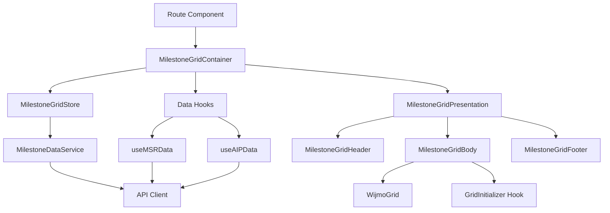

# MilestoneGrid Dependencies Analysis

## 現在の依存関係マップ

### 1. 外部ライブラリ依存
```typescript
// Wijmo関連
import * as wjcCore from '@mescius/wijmo';
import '@mescius/wijmo.cultures/wijmo.culture.ja';
import type { FlexGrid, GridPanel } from '@mescius/wijmo.grid';
import * as wjGrid from '@mescius/wijmo.react.grid';
import '@mescius/wijmo.styles/wijmo.css';

// React Router
import { useNavigate, useParams } from '@tanstack/react-router';

// UI Icons
import { AlertCircle } from 'lucide-react';

// React
import type React from 'react';
import { useCallback, useEffect, useState } from 'react';
```

### 2. グローバルストア依存
```typescript
import { useFgsStore } from '@/stores/useFgsStore';
import { usePipDetailStore } from '@/stores/usePipDetailStore';
import { usePipGenerationModeStore } from '@/stores/usePipGenerationModeStore';
import { usePipsStore } from '@/stores/usePipsStore';
import { useSelectedFGStore } from '@/stores/useSelectedFgStore';
import { useSelectedJobNoStore } from '@/stores/useSelectedJobNoStore';
```

### 3. 型定義依存
```typescript
import type { AIPVendor, AIPVendorResponse } from '@/types/common-api';
import type { MSRHeaderType, MSRAIPDataType } from '../types/milestone';
```

### 4. 内部コンポーネント依存
```typescript
import { EmptyState } from '@/components/EmptyState';
import { VendorSelectionPanel } from './VendorSelectionPanel';
import { SaveButton } from './SaveButton';
```

### 5. カスタムフック依存
```typescript
import { useFunctionGroups } from '../../psys-randing/hooks/useFunctionGroups';
import { useFetchAndTransformPips } from '../hooks/useFetchAndTransformPips';
import { useInitializeMilestoneGrid } from '../hooks/useInitializeMilestoneGrid';
import { useMSRData } from '../hooks/useMSRData';
import { useMSRHeader } from '../hooks/useMSRHeader';
```

### 6. ユーティリティ関数依存
```typescript
import { createColumnGroups } from '../utils/createColumnGroups';
import { saveMilestoneRow } from '../utils/saveMilestoneRow';
import { initInfiniteScrollHandler } from '../utils/initInfiniteScrollHandler';
```

## 依存関係の問題点

### 1. 循環依存のリスク
- MilestoneGrid → カスタムフック → Store → MilestoneGrid の循環参照の可能性

### 2. 密結合
- 6つのグローバルストアへの直接依存
- ビジネスロジックとUIロジックの混在

### 3. テスタビリティ
- 多数の外部依存により、単体テストが困難
- モックが必要な要素が多すぎる

## リファクタリング後の依存関係設計

### Layer 1: Container（データ取得層）
```typescript
// 依存を最小限に
import { useMSRData } from '../hooks/useMSRData';
import { useMilestoneGridStore } from '../stores/milestoneGridStore';
import { MilestoneGridPresentation } from './MilestoneGrid/MilestoneGridPresentation';
```

### Layer 2: Presentation（UI層）
```typescript
// Props経由でデータを受け取る
import { FlexGrid } from '@mescius/wijmo.grid';
import { useWijmoGridInitializer } from '../hooks/grid/useWijmoGridInitializer';
// 型定義のみインポート
import type { MilestoneGridPresentationProps } from '../types/milestoneGrid.types';
```

### Layer 3: Store（状態管理層）
```typescript
// Zustandのみに依存
import { create } from 'zustand';
import type { MilestoneGridStore } from '../types/milestoneGrid.types';
```

### Layer 4: Service（ビジネスロジック層）
```typescript
// APIクライアントと型定義のみ
import { apiClient } from '@/lib/api-client';
import type { MSRAIPDataType } from '../types/milestone';
```

## 依存関係グラフ



## 移行時の注意点

### 1. 段階的な依存解消
- Phase 1: 新しいStore層の作成
- Phase 2: グローバルストアからの移行
- Phase 3: コンポーネント分割
- Phase 4: 旧コードの削除

### 2. インターフェースの維持
- 既存のPropsインターフェースを維持
- 後方互換性のためのアダプター層

### 3. テストの追加
- 各層に対する単体テスト
- 依存性注入を使用したモックテスト

## チェックリスト

- [ ] 各層の責任範囲が明確
- [ ] 循環依存が存在しない
- [ ] 外部依存が最小限
- [ ] テスト可能な構造
- [ ] 型安全性が保証されている